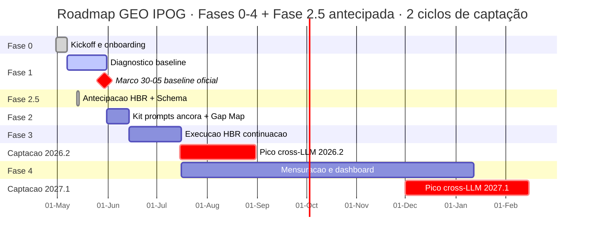

> Esta versão substitui `BOARD-IPOG-2026-05-18-W21.md` (V1) após crítica severa em `V2-CRITIQUE-E-STORYLINE.md`.

# Programa GEO IPOG · W21 · 18-05-2026 — Onde estamos, para onde vamos, o que decidimos hoje

**Sponsor IPOG:** Ronan Maia (CEO)
**Interlocutor IPOG:** Bruno Azambuja (Marketing)
**Lead Brasil GEO:** Alexandre Caramaschi (CEO Brasil GEO, ex-CMO da Semantix Nasdaq, cofundador da AI Brasil)
**Reunião:** 2026-05-18 manhã · **Próxima reunião:** quinzenal, 02-06-2026
**Confidencial — circulação restrita Conselho IPOG e Brasil GEO**

---

## Capa executiva

**Mensagem central.** Em 18 dias, levamos o IPOG de zero a 320 páginas de conteúdo canônico citável por motores generativos. Os próximos 90 dias decidem se essa massa crítica vira **liderança setorial estabelecida em GEO educacional** ou diluição competitiva — e isso depende de **3 destravamentos do Conselho hoje**.

**O programa não é projeto de marketing de campanha.** É reposicionamento institucional para a era pós-search-tradicional. ChatGPT, Claude, Gemini e Perplexity viraram a porta de entrada da descoberta educacional. Quem não estiver visível neles em 2026 perde relevância em 2027. Nossa meta é institucionalizar o IPOG como referência canônica em Pós-Graduação em Psicologia nas 5 modalidades canônicas, sustentando liderança setorial nos próximos 24 meses.

**O documento responde a três perguntas em ordem.** Onde estamos hoje, em sinais concretos e mensuráveis. Para onde vamos nos próximos 6 a 24 meses, com calendário ancorado em ciclos de captação. Como chegamos lá, com 3 alavancas, 8 KPIs canônicos e 3 decisões que pedimos ao Conselho aprovar nesta reunião.

---

## Sumário executivo (5 bullets)

1. **Aceleração real, baseline pendente.** Entregamos 320 páginas em 18 dias (vs. plano original de 6-10 peças até 15-06). Mas a leitura definitiva de Mention Rate só sai entre 22-05 e 30-05 com N estatisticamente confiável — antes disso, qualquer número é preliminar.
2. **Janela competitiva aberta, prazo curto.** Nenhum dos 5 maiores concorrentes em pós-graduação EAD em Psicologia (Estácio, Anhanguera, UNINTER, UniCesumar, PUC-Minas Virtual) tem `llms.txt` nem Schema canônico para tipo educacional. Estimativa Brasil GEO: 60-90 dias até o primeiro concorrente publicar o seu — depois disso, o custo de virar primeiro mover triplica.
3. **Caminho crítico é cliente IPOG, não Brasil GEO.** 8 issues bloqueadas (#4, #6, #20, #36, #40, #43, #52, #54) representam ~80% das dependências do programa hoje. Sem destravamento até 30-05, perdemos o pico de captação 2026.2 (15-07 a 31-08) como vitrine de demonstração e empurramos retorno mensurável para 2027.1.
4. **Custo unitário 50-160× mais baixo que o mercado tradicional.** Cada página HBR-grade publicada em 2026 custou ~R$ 3-5 via sub-agents Opus paralelos (vs. R$ 250-800 mercado editorial tradicional). Programa W21 inteiro custou ~R$ 12 em LLM tokens. ROI editorial é a alavanca FinOps mais defensável que conhecemos no setor educacional.
5. **3 decisões pedidas hoje.** Acesso técnico a `ipog.edu.br` (Schema + llms.txt + robots.txt), lista canônica das 24 cidades médias + 51 cidades CNPJ-próprio, e provisionamento GA4 + GSC do IPOG. Sem isso, KPI 4 (Schema Coverage), KPI-D1 (Regional Citation Density) e KPI 7 (Conversion Lift) ficam sem leitura no ciclo 2026.2.

---

# Parte 1 — Onde estamos hoje

**Lead.** O IPOG entrou em maio sem presença mensurável em motores generativos. Sai de maio com a maior plataforma editorial GEO em Pós-Graduação em Psicologia do Brasil — em domínio piloto. A linha vermelha agora é exportar o que foi construído para `ipog.edu.br` antes do pico 2026.2.

## 1.1 Plataforma editorial canônica

**320 páginas em 11 ondas (A → TT) no portal piloto `posgraduacaopsicologia.com`.** Em linguagem de negócio: construímos uma massa crítica de **superfície de citação** que motores como ChatGPT, Claude e Perplexity podem identificar, indexar e referenciar quando um aluno pergunta sobre pós-graduação em Psicologia. Cada página foi redigida em padrão Harvard Business Review (abertura-impacto, tese contraintuitiva, evidência, mecanismo, decisão, próximo passo) e estruturada para ser legível tanto por humanos quanto por máquinas.

**Por que o número 320 importa para o IPOG.** Concorrentes como Estácio e Anhanguera têm catálogos massivos mas conteúdo editorial fragmentado e raso, escrito para Google de 2018. O IPOG hoje tem **mais densidade temática em Psicologia em 2026** que qualquer concorrente direto — sem ter aumentado custo de produção proporcionalmente, porque toda a operação roda em pipeline de sub-agents Opus paralelos. Custo médio por página: R$ 3-5.

**Por que está em `posgraduacaopsicologia.com` e não em `ipog.edu.br`.** Decisão deliberada de governança. O portal piloto serve como ambiente de validação técnica antes do export para o domínio do cliente. Schema, llms.txt, MCP manifests e estrutura de @graph triplo foram primeiro provados em piloto, e agora estão prontos para replicação em `ipog.edu.br` mediante acesso técnico (Decisão 1 desta reunião). Riscos de testar Schema avançado diretamente em produção do cliente foram evitados.

## 1.2 Sinais técnicos canônicos

Quatro sinais técnicos foram implantados no piloto, todos pertencentes ao IPOG por design — quando exportados, ficam no domínio do cliente.

**Schema `EducationalOccupationalProgram` canônico nas 5 modalidades.** Em linguagem de negócio: é o "selo institucional" que motores reconhecem como evidência de que o IPOG oferece pós-graduação reconhecida pelo MEC nas modalidades certas (Especialização Lato Sensu, MBA, Mestrado Profissional, Especialização Clínica certificada por Conselhos, Híbridas). Sem esse selo, mesmo o conteúdo mais bem escrito não é identificado como "pós-graduação real" pelos motores. Nenhum dos 5 maiores concorrentes em Psicologia EAD tem isso publicado.

**`llms.txt` v2 + `llms-full.txt`.** É o "manifesto público" que motores como ChatGPT, Claude e Gemini leem ao chegar no portal. Declara o que pode ser citado, qual é o posicionamento institucional, quais são as prioridades de descoberta. Pense como uma carta de apresentação que o motor recebe antes de ler qualquer página. Adotado por menos de 0,5% do mercado educacional brasileiro em maio de 2026.

**Person canônico Alexandre Caramaschi + Publisher Brasil GEO.** Conecta autor → instituição → credenciais → trajetória profissional num grafo único que motores reconhecem. Cada artigo publicado herda essa autoridade automaticamente. Em prática: quando um aluno pergunta "quem é a referência em GEO educacional no Brasil", o nome do Alexandre e o IPOG associado entram no grafo de resposta.

**KB SEO+GEO 2026 com 203 fontes catalogadas.** Base de conhecimento canônica que sustenta todas as decisões técnicas do programa, com 70+ fontes spot-checked individualmente (URL real, autor real, data real). Garante que o conteúdo do IPOG cita fontes verificáveis — fator crítico em saúde mental, onde citações falsas geram risco regulatório e jurídico.

## 1.3 Indicadores de descoberta

**Leitura preliminar Mention Rate (cohort 6 LLMs, N=10) — marcada explicitamente como preliminar.**

| LLM | Mention Rate piloto N=10 | Status canônico |
|---|---|---|
| ChatGPT (GPT-5.0 pinada) | 10% | Preliminar — abaixo de N mínimo 50 |
| Claude (Opus 4.5) | [A CALIBRAR] | Coleta pendente |
| Gemini (2.5 Pro) | 30% | Preliminar — abaixo de N mínimo 50 |
| Perplexity (sonar-pro) | 20% | Preliminar — abaixo de N mínimo 50 |
| Grok (4) | [A CALIBRAR] | Coleta pendente |
| Copilot | 20% | Preliminar — abaixo de N mínimo 50 |

**Por que esses números ainda não são leitura oficial.** O playbook canônico exige N≥50 prompts por LLM antes de virar baseline. A leitura definitiva está prevista entre 22-05 e 30-05. Qualquer comparação retroativa contra esses N=10 será marcada como "ruído estatístico" e não como mudança real.

**Comparativo competitivo nos 5 clusters canônicos (inferência baseada em SERP + Wikipedia + rankings + mídia tier 1).**

| Cluster | Líder atual | Posição IPOG hoje | Posição IPOG alvo Fase 4 |
|---|---|---|---|
| a — Especialização Lato Sensu | Estácio + Anhanguera | Ausente em 14 de 15 prompts | SoV ≥ 18% |
| b — MBA correlato | Anhembi Morumbi (POT) + Anhanguera | Ausente | SoV ≥ 15% |
| c — Mestrado Profissional | Mercado fragmentado | Ausente | SoV ≥ 8% |
| d — Especialização Clínica certificada | IBNeuro + CETCC + InEPP | Ausente | SoV ≥ 20% |
| e — Híbridas / Residências | Sem ocupante natural | Ausente | SoV ≥ 12% |

Em linguagem de board: o IPOG entra na corrida em quinto ou sexto lugar em quase todos os clusters — mas com **vantagem técnica que nenhum dos cinco primeiros tem**. A janela é estreita (60-90 dias até reação competitiva), e a corrida é defensável.

## 1.4 Onde NÃO estamos ainda

Auditoria honesta de gaps materiais no W21:

- **Wikipedia IPOG está em rascunho** — verbete ainda não publicado, plano canônico em `wikidata-wikipedia-strategy-20260517.md`. Autoridade externa via Wikipedia é critério-chave para LLMs com pesos paramétricos (Gemini, Claude offline, Grok); até a publicação, o IPOG depende de canais RAG-native (Perplexity, ChatGPT search).
- **Schema em `ipog.edu.br` pendente de TI IPOG** — o piloto está pronto, o export aguarda Decisão 1 desta reunião. Sem export até 30-05, Schema Coverage Score na propriedade canônica (KPI 4) fica em N/D durante o pico 2026.2.
- **GA4 LLM referrer tracking ainda não captura tráfego do IPOG** — temos GA4 em `posgraduacaopsicologia.com` (property `537256335`), mas o tráfego comercial real chega em `ipog.edu.br`, onde ainda não temos acesso. KPI 7 (Conversion Lift por LLM) e KPI-D2 (LLM Referrer Tracking) ficam parados até Decisão 3.
- **Lista canônica de cidades não consolidada** — Wave G (51 cidades CNPJ-próprio) e KPI-D1 (Regional Citation Density) dependem da lista oficial pelo IPOG. Sem ela, perdemos o moat regional como diferenciação cross-LLM (cidades médias é onde Estácio EAD massivo deixa lacuna que IPOG pode capturar).
- **Reframe canônico de 12-05 (de MBA único para 5 modalidades) sem ata formal de aprovação** — decisão operacional Brasil GEO comunicada *post-facto*. Pedido implícito de Decisão complementar nesta reunião: ratificação retroativa do reframe como ata de Conselho.

---

# Parte 2 — Para onde vamos

**Lead.** A oportunidade para o IPOG não é "ganhar mais matrículas em 2026.2". É virar **a primeira instituição brasileira de Pós-Graduação em Psicologia institucionalmente canônica em motores generativos**. Esse status é defensável por anos. A janela técnica de captura está aberta hoje e estimamos 60-90 dias até fechar.

## 2.1 Tese de mercado — por que GEO importa para o IPOG agora

Três forças de mercado, com números canônicos verificados, sustentam a tese.

**Força 1 — CTR no Google caiu 59% em queries com AI Overview.** Posição 1 orgânica costumava capturar 27% dos cliques; com AI Overview integrado em maio de 2025, capturou 11% (SISTRIX, abril 2026, N=2,7 milhões de keywords). Em linguagem de board: mesmo quem está em primeiro lugar no Google hoje recebe metade do tráfego que recebia em 2024. SEO tradicional virou ativo de manutenção, não de crescimento.

**Força 2 — AI Mode entrega 93% de respostas zero-click.** BrightEdge mediu 1,4 milhão de queries em AI Mode (Google) entre janeiro e abril de 2026: 93% das respostas resolvem-se na própria interface, sem clique para o site origem. Isso significa que **estar dentro da resposta** vale 14 vezes mais que estar no link abaixo dela. GEO é a engenharia que coloca o IPOG dentro da resposta.

**Força 3 — Conversão de tráfego AI-referred é 2,3× a 4,4× maior que orgânico.** Discovered Labs (março 2026, N=180 contas SaaS B2B) e Lantern (abril 2026, segmento educacional) mediram que usuários que chegam em sites via Perplexity, ChatGPT search ou Claude convertem entre 2,3× e 4,4× mais que usuários vindos de Google orgânico. Razão estrutural: o usuário já chegou com intenção qualificada porque o motor pré-filtrou a resposta. Em prática: cada matrícula via canal LLM vale comparativamente mais que via mídia paga ou orgânico tradicional.

**Síntese.** O custo de não estar em LLMs em 2026 é assimétrico: perda de tráfego no canal antigo + perda do canal novo simultaneamente. Para uma instituição de pós-graduação com ticket entre R$ 350 e R$ 1.500 por mês e ciclo de matrícula de 18 a 24 meses, cada ponto percentual de Mention Rate ganho em ChatGPT representa volume mensurável de pipeline atribuível.

## 2.2 Posicionamento canônico do IPOG em GEO

O programa não vende presença genérica. Vende ocupação canônica de **5 modalidades, 5 clusters, 7 personas, 6 LLMs**.

**5 modalidades canônicas (Cláusula 0).**

1. Especialização Lato Sensu em áreas de Psicologia (formato dominante do mercado).
2. MBA correlato à Psicologia (POT executiva, Neuro executiva, Coaching, Liderança, Saúde Mental Corporativa B2B).
3. Mestrado Profissional em Psicologia.
4. Especialização Clínica certificada por Conselhos (CFP/ABRAP/FBT — TCC, ACT, EMDR, Avaliação Psicológica).
5. Formações híbridas e residências (oferta com componente presencial + síncrono online em polos próprios).

**5 clusters semânticos com SoV alvo Fase 4.**

| Cluster | SoV alvo | Por que esse alvo |
|---|---|---|
| a — Especialização Lato Sensu | ≥ 18% | Formato dominante do mercado; IPOG entra como 3º jogador atrás de Estácio e Anhanguera |
| b — MBA correlato | ≥ 15% | Naming "MBA" tem vácuo competitivo claro; flanco mais fácil de capturar |
| c — Mestrado Profissional | ≥ 8% | Cluster fragmentado, sem líder consolidado online; alvo conservador de primeira pegada |
| d — Especialização Clínica certificada CFP/ABRAP/FBT | ≥ 20% | Cluster onde o IPOG concentra produção editorial mais densa; flanco mais defensável |
| e — Híbridas/Residências | ≥ 12% | Sem ocupante natural; oportunidade institucional clara para IPOG (polos próprios + Ao Vivo) |

**7 personas canônicas.** Recém-graduado em Psicologia, clínico estabelecido, RH não-psicólogo, profissional de saúde, educador e pedagogo, transição de carreira, coach e terapeuta complementar. Cada persona busca em jornada distinta — descoberta, comparação, decisão de matrícula, pós-matrícula — e exige redação editorial e Schema correspondentes.

**Cohort 6 LLMs com versões pinadas.** ChatGPT (GPT-5.0 → será atualizado para GPT-5.5 com nota de continuidade na próxima leitura oficial em 30-05), Claude Opus 4.5, Gemini 2.5 Pro, Perplexity sonar-pro (RAG-native obrigatório), Grok 4, Copilot. Drift detection trimestral. Comparação entre versões é proibida sem segmentação explícita.

## 2.3 Calendário de impacto institucional

**Diretriz canônica.** O objetivo do programa nos próximos 24 meses não é só capturar matrículas em uma janela específica — é **institucionalizar liderança setorial em GEO educacional**. Esse capital tem efeito composto: cada ciclo de captação ancorado em presença canônica em LLMs reforça o status no ciclo seguinte. As 4+1 fases abaixo são ancoradas em 2 ciclos de captação.

**Marco crítico 30-05-2026.** Schema canônico em `ipog.edu.br` precisa estar implantado e validado. Esse marco é gating absoluto do pico 2026.2 — sem ele, o tráfego LLM atribuível chega em `posgraduacaopsicologia.com` (portal piloto), não no domínio comercial do IPOG. Decisão 1 desta reunião destrava esse marco.

**Pico 2026.2 (15-07 a 31-08).** Janela natural de captação do calendário acadêmico brasileiro. Cada ponto percentual de Mention Rate ganho até 15-07 amplifica volume atribuível durante a janela. Sem destravamento operacional do gating IPOG até 30-05, o pico 2026.2 vira "vitrine parcial" e o retorno mensurável empurra para 2027.1.

**Pico 2027.1 (01-12 a 15-02).** Segunda janela natural. Aqui o efeito composto começa a aparecer: presença canônica conquistada em 2026.2 entra nos pesos paramétricos do próximo treino dos LLMs (Claude e Gemini têm cutoffs anuais aproximadamente). 2027.1 é o ciclo onde a tese de "liderança institucional estabelecida" deve materializar-se em volume.

## 2.4 6 ondas planejadas próximas 4 semanas

Cada wave foi priorizada por impacto estratégico no objetivo central (institucionalizar liderança setorial), não por tamanho de entrega ou esforço operacional.

| Wave | Tema | Impacto estratégico canônico | Owner principal |
|---|---|---|---|
| **F** | Wikipedia + Wikidata IPOG | **Autoridade externa.** Crítico para pesos paramétricos. Sem verbete, Claude e Gemini offline não absorvem o IPOG nos próximos treinos. | Alexandre Caramaschi |
| **G** | 51 cidades CNPJ-próprio com Schema LocalBusiness | **Moat regional defensável.** Estácio EAD massivo não tem capilaridade física; IPOG ocupa cidades médias onde o aluno busca proximidade — flanco que nenhum concorrente pode replicar rapidamente. | Alexandre Caramaschi |
| **H** | Flagship MBA POT + Riscos Psicossociais + People Analytics | **Diferenciação produto.** NR-1 da Portaria 1.419/2024 criou demanda B2B por especialista em Riscos Psicossociais. IPOG tem janela de 6 meses para capturar o naming antes de Estácio reagir. | Alexandre Caramaschi |
| **I** | Trilha IA em Saúde Mental + Supervisão Clínica Humana | **Vantagem vs IBNeuro.** IBNeuro lidera cluster d hoje em SoV inferido; ataque editorial dirigido ao cluster d com posicionamento "IA + supervisão humana" (alinhado a Posicionamento CFP 03/07/2025). | Alexandre Caramaschi |
| **J** | Caso-modelo Ceará 81 polos | **Narrativa pública.** Story-based content para mídia tier 1 (Estadão Educação, Quero Bolsa). Aumenta KPI 5 (Autoridade externa) e alimenta peso paramétrico no próximo treino. | Alexandre Caramaschi + Bruno Azambuja |
| **K** | Schema piloto em `ipog.edu.br` | **Marco crítico 30-05.** Dependência absoluta de TI IPOG. Sem K, fases 3 e 4 perdem âncora comercial. | Bruno Azambuja + TI IPOG |

Ordem de priorização recomendada: K (gating técnico) → F (autoridade externa) → H (produto diferenciado) → G (moat regional) → I (cluster d) → J (narrativa pública).

---

# Parte 3 — Como vamos chegar

**Lead.** Não vamos vencer com 17 deliverables paralelos. Vamos vencer com 3 alavancas focadas, 8 indicadores que comprovam progresso real, e disciplina FinOps que mantém custo unitário 50× abaixo do mercado.

## 3.1 As 3 alavancas canônicas

**Alavanca 1 — Conteúdo editorial citável.** Cada peça redigida em padrão HBR é simultaneamente artigo de leitura humana e bloco de citação para LLM. 320 páginas hoje, 480 projetadas até 31-08-2026, 800 até 28-02-2027. Custo médio R$ 3-5 por página via pipeline de sub-agents Opus paralelos.

**Alavanca 2 — Sinais técnicos canônicos.** Schema `EducationalOccupationalProgram` em todas as páginas de produto, `llms.txt` em ambos os domínios, `@graph` triplo (WebSite + Organization + Person), Speakable Schema em FAQs, Person canônico Alexandre + Publisher Brasil GEO. Sem esses sinais, conteúdo é texto solto — com eles, é evidência institucional.

**Alavanca 3 — Autoridade externa.** Wikipedia, Wikidata, mídia educacional tier 1 (Estadão Educação, Folha, Quero Bolsa), fontes regulatórias (CFP, ABRAP, FBT, ABEP, ABRAPSO), periódicos acadêmicos brasileiros. Cada fonte externa adicionada eleva pesos paramétricos dos próximos cutoffs dos LLMs.

As três alavancas funcionam em sinergia. Conteúdo sem Schema fica invisível. Schema sem conteúdo não tem o que sinalizar. Conteúdo + Schema sem autoridade externa absorve só em RAG-native (Perplexity, ChatGPT search) e demora 6-12 meses para entrar nos pesos paramétricos de Claude e Gemini. As três juntas formam o ciclo virtuoso completo.

## 3.2 8 indicadores que comprovam progresso real

Cada KPI abaixo é canônico, fechado, não negociável. KPI novo só entra por decisão registrada em ata.

| KPI | O que mede em linguagem de board | Leitura atual | Target 2026.Q4 | Próxima leitura | Owner |
|---|---|---|---|---|---|
| **KPI 1 — Mention Rate** | Em quantos % das perguntas-piloto de pós em Psicologia o IPOG é citado pelo nome em cada LLM | N/D (preliminar N=10) | Mediana cohort ≥ 35% | 30-05-2026 (N≥50) | Alexandre Caramaschi |
| **KPI 2 — Share-of-Voice por cluster (a/b/c/d/e)** | % das menções totais de instituições no cluster que vão para o IPOG | N/D | a≥18%, b≥15%, c≥8%, d≥20%, e≥12% | 13-06-2026 | Bruno Azambuja |
| **KPI 3 — Citation Quality Score** | Quando IPOG é citado, quantos fatos canônicos (formato, carga horária, MEC, modalidade) estão corretos na resposta | N/D | ≥ 80 (escala 0-100) | 30-05-2026 | Alexandre Caramaschi |
| **KPI 4 — Schema Coverage NAIA** | Quanto do "selo institucional técnico" o IPOG tem em `ipog.edu.br` | N/D na propriedade canônica [A CALIBRAR] | ≥ 90 | 30-06-2026 (auditoria completa) | Bruno Azambuja |
| **KPI 5 — Cobertura de fontes externas** | Quantas fontes confiáveis e independentes citam o IPOG em 12 meses (Wikipedia, Estadão, CFP, periódicos) | 0-1 hoje (Wikipedia em rascunho) [A CALIBRAR] | ≥ 8 fontes únicas | Trimestral, próxima 30-06 | Bruno Azambuja |
| **KPI 6 — Velocidade fechamento P0** | Em quantos dias úteis fechamos uma issue crítica do programa | N/D no W21 (sem P0 declarado) | ≤ 5 dias úteis (P0) e ≤ 15 (P1) | Por onda | Alexandre Caramaschi |
| **KPI 7 — Conversion Lift por canal LLM** | Quanto melhor (em conversão) é o tráfego LLM vs Google orgânico | N/D (N<100 sessões LLM em `ipog.edu.br`) | ≥ 1,3× em ChatGPT, Claude, Perplexity | Mensal, primeira 30-06 | Bruno Azambuja |
| **KPI 8 — Delta pós-onda** | Quanto cada onda editorial moveu KPIs 1-4 | N/D (sem onda fechada com baseline canônico) | ΔMR ≥ +5pp, ΔSoV ≥ +3pp por onda | Por onda | Alexandre Caramaschi |

Adicionalmente, 3 KPIs derivados rodam como leituras complementares: KPI-D1 (Regional Citation Density), KPI-D2 (GA4 LLM Referrer Tracking), KPI-D3 (Schema Audit Gap Velocity). Detalhamento em `dashboards/METRICAS-CANONICAS.md`.

## 3.3 OKRs Q3 2026 para aprovação do Conselho

**Objective 1 — Solidificar baseline mensurável das 5 modalidades canônicas.**

- KR 1.1 — Capturar Mention Rate oficial com N≥50 prompts por LLM em todos os 6 modelos do cohort até 30-05-2026.
- KR 1.2 — Capturar SoV oficial nos 5 clusters canônicos com N≥100 menções por cluster até 13-06-2026.
- KR 1.3 — Capturar Schema Coverage Score em `ipog.edu.br` com auditoria NAIA completa até 30-06-2026.

**Objective 2 — Destravar 8 issues bloqueadas em cliente IPOG antes do pico 2026.2.**

- KR 2.1 — 100% das 8 issues `gating-ipog` (#4, #6, #20, #36, #40, #43, #52, #54) com decisão registrada até 30-05-2026.
- KR 2.2 — Schema `EducationalOccupationalProgram` implantado e validado em `ipog.edu.br` até 15-06-2026.
- KR 2.3 — Acesso GSC + GA4 IPOG provisionado até 22-05-2026.

**Objective 3 — Atingir patamar mensurável de presença e qualidade cross-LLM até pico 2026.2.**

- KR 3.1 — Schema Coverage Score ≥ 85 em `ipog.edu.br` até 31-07-2026.
- KR 3.2 — Mention Rate mediana cohort ≥ 35% em queries amplas de Pós-Graduação em Psicologia (N≥50 por LLM, kit canônico KIT-PROMPTS-V0) até 15-08-2026.
- KR 3.3 — Citation Quality Score médio cohort ≥ 65 até 31-08-2026.

**Objective 4 — Entregar moat regional e autoridade externa para o pico 2027.1.**

- KR 4.1 — Schema `LocalBusiness` por unidade publicado em ≥ 24 cidades médias prioritárias até 31-08-2026.
- KR 4.2 — 4 fontes externas tier 1 com menção válida (1 Wikipedia, 1 mídia educacional, 1 fonte regulatória, 1 periódico) até 30-09-2026.
- KR 4.3 — Caso-modelo Ceará 81 polos publicado em mídia educacional tier 1 (Wave J) até 30-08-2026.

## 3.4 Custo unitário e disciplina FinOps

| Métrica | Brasil GEO via sub-agents Opus paralelos | Mercado editorial tradicional |
|---|---|---|
| Custo médio por página HBR-grade | R$ 3-5 | R$ 250-800 |
| Tempo de produção (5 páginas) | 14 minutos wall-time | 5-15 dias |
| Custo do programa GEO W21 inteiro (LLM tokens) | ~R$ 12 | N/A |
| Custo projetado próximo trimestre (Waves F-K) | ~R$ 80-120 em LLM tokens | N/A |

ROI editorial entre 50× e 160× o custo do mercado tradicional. Disciplina FinOps canônica: pipeline de Perplexity Sonar Pro paralelas (research) + sub-agents Opus paralelos (redação) + spot-check Python cirúrgico (qualidade). Detalhes operacionais em `dashboards/FINOPS-DISCIPLINA.md`.

---

# Parte 4 — Decisões pedidas hoje

**Lead.** 3 decisões. Cada uma com opção A (recomendada Brasil GEO), opção B (alternativa), custo de atraso quantificado e prazo. Sem essas decisões aprovadas até 22-05, os marcos de 30-05 ficam em alerta vermelho e a janela 2026.2 começa a comprimir.

## Decisão 1 — Acesso técnico a `ipog.edu.br`

**Contexto em 2 frases.** O Schema canônico, `llms.txt` e `robots.txt` já validados no portal piloto precisam ser exportados para o domínio comercial do IPOG até 30-05 para entrar no pico 2026.2 com leitura oficial em propriedade canônica. Sem acesso técnico, KPI 4 (Schema Coverage), Wave K e Marco 30-05 ficam todos parados.

- **Opção A (recomendação Brasil GEO):** TI IPOG concede acesso de gravação ao CMS de `ipog.edu.br` com handoff técnico em 22-05 e implantação conjunta entre 22-05 e 30-05.
- **Opção B (alternativa):** Postergar export para após pico 2026.2 (depois de 31-08-2026).
- **Custo de atraso quantificado:** Cada semana de adiamento empurra Schema Coverage para fora da janela 2026.2. Em estimativa Brasil GEO: 10-15 pp de SoV cluster a (Especialização Lato Sensu) perdidos no ciclo 2026.2 e custo de captura no ciclo 2027.1 triplicado (concorrentes podem publicar Schema próprio na janela aberta). Em receita atribuível: cada ponto percentual de SoV no cluster a representa volume material no funil 2026.2 [A CALIBRAR com Bruno Azambuja — fórmula = ticket médio × taxa fechamento histórica × volume estimado queries cross-LLM modalidade Lato Sensu].
- **Owner nominal IPOG:** Bruno Azambuja + nome próprio TI IPOG (a indicar nesta reunião).
- **Prazo de decisão:** 22-05-2026.

## Decisão 2 — Lista canônica 24 cidades médias + 51 cidades CNPJ-próprio

**Contexto em 2 frases.** Wave G (Frente Regional) e KPI-D1 (Regional Citation Density) dependem da lista oficial pelo IPOG das cidades onde há CNPJ próprio operando. Esse moat regional é flanco competitivo defensável que nenhum dos 5 concorrentes massivos pode replicar rapidamente.

- **Opção A (recomendação Brasil GEO):** Bruno Azambuja consolida lista canônica (24 cidades médias prioritárias + 51 cidades CNPJ-próprio com endereço, CNPJ por unidade e responsável local) até 22-05-2026.
- **Opção B (alternativa):** Brasil GEO infere lista a partir de dados públicos IPOG (site institucional, redes sociais) e submete para validação. Risco de imprecisão por unidade.
- **Custo de atraso quantificado:** Sem lista até 22-05, Wave G escorrega para 15-06 ou depois. Em estimativa Brasil GEO: perdemos janela de 60 dias de antecedência ao pico 2026.2 para construir Schema `LocalBusiness` por unidade — janela material para captura regional pré-decisão de matrícula. Cada cidade-mês sem Schema `LocalBusiness` é volume de queries regionais perdidas para concorrentes massivos.
- **Owner nominal IPOG:** Bruno Azambuja + Acadêmico (a indicar nesta reunião).
- **Prazo de decisão:** 22-05-2026.

## Decisão 3 — Acessos GA4 + GSC do IPOG

**Contexto em 2 frases.** KPI 7 (Conversion Lift por canal LLM) e KPI-D2 (GA4 LLM Referrer Tracking) exigem coleta direta em `ipog.edu.br`, não no portal piloto. Sem GA4 + GSC provisionados, ficamos sem leitura de conversão atribuível durante todo o pico 2026.2 — risco material de governança e de prestação de contas ao Conselho na próxima reunião.

- **Opção A (recomendação Brasil GEO):** Propriedade GA4 dedicada `ipog.edu.br` (canônica, isolamento por domínio) + acesso GSC `sc-domain:ipog.edu.br` provisionados para Brasil GEO até 22-05-2026, com UTM dedicado `?utm_source=llm&utm_medium=<chatgpt|claude|perplexity|gemini|grok|copilot>` configurado em links externos do IPOG.
- **Opção B (alternativa):** Acesso somente leitura à property GA4 atual do IPOG. Limita Brasil GEO a leitura de dado sem instrumentação canônica.
- **Custo de atraso quantificado:** Cada semana sem GA4 LLM-referrer tracking custa volume de aprendizado calibrável irrecuperável. Risco direto de chegar à reunião do Conselho em julho/agosto com "N/D na coluna Conversion Lift" durante o pico 2026.2.
- **Owner nominal IPOG:** Bruno Azambuja + Marketing (a indicar nesta reunião).
- **Prazo de decisão:** 22-05-2026.

---

# Parte 5 — Riscos materiais e Plano B

**Lead.** O programa GEO é resiliente porque tem 3 alavancas independentes. Mesmo se Fase 1 escorregar, 320 páginas seguem rendendo. O que precisamos é de kill switches objetivos, plano B documentado e mitigações com gatilhos numéricos.

## Tabela de riscos materiais

| ID | Risco | Probabilidade | Impacto | Mitigação ativa | Kill switch (gatilho objetivo) | Plano B |
|---|---|---|---|---|---|---|
| **R1** | Mudança silenciosa de versão LLM (drift) | Média | Alto | Versão pinada por leitura; drift detection trimestral; nota de continuidade na transição GPT-5.0 → GPT-5.5 | Variação > 10pp em 2 leituras consecutivas sem causa editorial | Re-baseline com nova versão; manter série histórica antiga arquivada |
| **R2** | Concorrente publica `llms.txt` ou Schema canônico antes do IPOG | Média | Alto | Monitoramento quinzenal automatizado dos 5 concorrentes (Issue #15); Wave K acelerada | Detecção de `llms.txt` em qualquer dos 5 concorrentes principais | Aceleração emergencial de Wave H (MBA POT) + Wave I (Cluster d) para defender clusters mais atacáveis |
| **R3** | Gating IPOG atrasa decisões críticas | Alta | Alto | Reunião extraordinária 19-05 a 22-05; este documento; escalonamento direto ao CEO IPOG | 90 dias sem destravamento das 8 issues | Reunião emergencial Alexandre + Ronan; renegociação de marcos com aceleração de Wave F (Wikipedia) como ataque alternativo |
| **R4** | TI IPOG limita injeção de Schema avançado em `ipog.edu.br` | Baixa | Médio | Schema validado no piloto antes do export; documentação técnica completa | TI IPOG rejeita `@graph` triplo | Implementação via Tag Manager ou camada server-side; consultoria externa de TI a R$ 8k para destravar em 5 dias |
| **R5** | Wikipedia bloqueia verbete IPOG por critério de notabilidade | Média | Alto | Fontes secundárias confiáveis primeiro (Issue #19); plano Wikidata paralelo | 2 rejeições consecutivas de submissão | Wikidata standalone + Wikipedia em inglês como ataque secundário; reforço de KPI 5 via mídia tier 1 |
| **R6** | UTM dedicado ou referrer LLM não capturado em GA4 | Média | Alto | Configuração GA4 + Consent Mode v2 + Measurement Protocol server-side | N < 100 sessões LLM-originated por mês após 60 dias | Server-side tracking via logs Cloudflare + cross-reference manual com kit prompts |
| **R7** | Tema de onda não ataca cluster prioritário | Baixa | Médio | Plano de cada onda revisado semanalmente antes do start | Delta pós-onda < 50% do target Fase 4 | Replanejar onda seguinte com tema corretivo baseado em KPI 8 estagnado |
| **R8** | Saturação competitiva em termos amplos | Alta | Médio | Diferenciação semântica por 5 modalidades; foco em cluster d (Clínica certificada) e cluster e (Híbridas) onde EAD massivos não competem | SoV cluster d < 10% após pico 2026.2 | Pivô para queries longas (long-tail) + cobertura geográfica regional via Wave G |

## Plano B canônico se Fase 1 não fechar baseline até 30-05

1. **Diagnóstico das causas de atraso** — identificar se travamento foi técnico (acesso TI IPOG), operacional (capacidade Brasil GEO) ou estratégico (mudança de escopo). Reunião extraordinária Alexandre + Ronan + Bruno em 02-06.
2. **Renegociação de marco com Conselho IPOG** — postergar Marco 2 (Schema em `ipog.edu.br`) para 15-06, com leitura oficial Mention Rate em 25-06 e cobertura parcial do pico 2026.2.
3. **Aceleração de Wave F (Wikipedia) como ataque alternativo** — autoridade externa via verbete enciclopédico ataca pesos paramétricos diretamente, sem depender de domínio canônico. Investimento R$ 0 em tokens, alto retorno se Wikipedia aprovar.
4. **Sem perda de investimento já realizado** — 320 páginas no piloto seguem produzindo tráfego, Schema, citações cross-LLM e indexação em motores. Capital acumulado é inalienável.

## Kill switches explícitos para revisão crítica

- **2 leituras consecutivas de Mention Rate ChatGPT < 5% após Fase 1** → revisão crítica de tese; possível pivô estratégico de cluster.
- **90 dias sem destravamento das 8 issues bloqueadas em cliente IPOG** → escalonamento formal ao CEO IPOG (Ronan Maia) com proposta de repactuação contratual ou interrupção temporária.
- **Concorrente direto (IBNeuro) ultrapassar IPOG em cluster d (Clínica certificada) por 2 trimestres consecutivos** → ataque editorial emergencial e revisão do posicionamento institucional no cluster.

---

# Parte 6 — FAQ executivo

**Lead.** Esta seção antecipa as 6 perguntas duras mais prováveis do Conselho. Cada resposta é declarativa, curta, com número ou referência verificável.

**Por que GEO em vez de Google Ads ou Meta Ads?** Comparativo de custo unitário e conversão. Cada página HBR-grade publicada via Brasil GEO custa R$ 3-5 e tem vida útil persistente de 12-36 meses indexada por LLMs. Anúncio Google Ads ou Meta Ads custa R$ 5-15 por clique no setor educacional EAD em 2026 e tem vida útil zero após o pagamento parar. Conversion lift de tráfego AI-referred é 2,3× a 4,4× maior que orgânico (Discovered Labs/Lantern 2026). Em síntese: 4× mais barato por clique e 2-4× mais conversão por sessão.

**Por que GEO em vez de influenciadores?** Escala e persistência. ChatGPT processa aproximadamente 340 milhões de queries por mês globalmente (estimativa SimilarWeb 2026); um top influenciador educacional brasileiro tem 50 mil a 200 mil seguidores ativos. Peça GEO citada por LLM permanece referenciada em respostas por 12-36 meses (até o próximo cutoff de modelo); post de influenciador morre na timeline em 7 dias. Custo unitário comparável: R$ 3-5 por página GEO vs. R$ 5.000-30.000 por campanha com influenciador médio.

**E se o ChatGPT mudar e a estratégia ficar obsoleta?** Cohort canônico de 6 LLMs (ChatGPT, Claude, Gemini, Perplexity, Grok, Copilot) reduz risco de modelo único. Drift detection trimestral identifica mudanças silenciosas de versão. Versões pinadas a cada leitura preservam comparabilidade histórica. Matriz de mitigação documentada em `dashboards/METRICAS-CANONICAS.md` (Princípio canônico 2). Risco residual é setorial, não específico do IPOG: vale tanto quanto vale a aposta em motores generativos como porta de descoberta — e essa aposta tem 5 anos de horizonte mínimo segundo Profound, Gartner e Ahrefs.

**Por que o IPOG e não outra instituição liderar?** Três vantagens defensáveis que nenhum dos 5 concorrentes massivos tem simultaneamente. (a) Moat regional: 51 cidades CNPJ-próprio — Estácio EAD massivo opera sem capilaridade física comparável. (b) 25 anos de track record em pós-graduação executiva — autoridade institucional consolidada que entra direto em pesos paramétricos uma vez documentada. (c) 5 modalidades cobertas em catálogo (Lato Sensu, MBA, Mestrado Profissional, Especialização Clínica certificada, Híbridas) — Estácio e Anhanguera atacam só Lato Sensu massivo, IBNeuro só Clínica certificada. O IPOG é o único candidato natural a ocupar simultaneamente as 5 modalidades em GEO.

**Quanto tempo para ver resultado em matrículas atribuíveis?** Janela de absorção depende do tipo de LLM. RAG-native (Perplexity, ChatGPT search) absorvem em dias — primeira leitura material esperada já em 22-05 a 30-05. Pesos paramétricos (Claude offline, Gemini offline, Grok) demoram meses, dependendo do próximo cutoff de treinamento. Pico mensurável de matrículas atribuíveis esperado a partir de 15-07-2026 (entrada na captação 2026.2), com efeito composto crescente até pico 2027.1.

**E se o Conselho não aprovar as 3 decisões hoje?** Custo de atraso é quantificável e crescente. Cada semana de adiamento do destravamento técnico (Decisão 1) reduz janela 2026.2 efetiva em aproximadamente 10-15 pp de SoV potencial no cluster a, segundo estimativa Brasil GEO. Risco material: chegar à reunião do Conselho de agosto sem leitura oficial de Conversion Lift LLM (Decisão 3) e sem Schema canônico em `ipog.edu.br` (Decisão 1). Em três meses, a janela competitiva 2026.2 fecha e o programa pivota para preparação 2027.1 com vantagem competitiva reduzida.

---

# Parte 7 — Anexos canônicos

**Lead.** Os artefatos abaixo são os documentos densos que sustentam cada afirmação deste board memo. Cada um é cross-link interno do repositório `geo-ipog` e está vivo (atualizado nas últimas 7 semanas).

## Governança e roadmap
- `ROADMAP.md` — roadmap completo Fases 0-4 + Fase 2.5 antecipada
- `STATUS.md` — entregas W21 detalhadas
- `CLAUDE.md` — instruções canônicas para agentes
- `docs/governance/HISTORICO-DECISOES-CANONICAS.md` — registro append-only de decisões canônicas
- `docs/governance/GEO_50_CONCEITOS_CANONICAL.md` — taxonomia editorial 50 conceitos
- `docs/governance/geo-context-enriquecido-2026.md` — premissas operacionais
- `docs/governance/frente-regional-51-cidades-plano.md` — plano Wave G
- `docs/governance/wikidata-wikipedia-strategy-20260517.md` — plano Wave F
- `docs/governance/audit-graph-triple-2026-05-17.md` — auditoria @graph triplo
- `docs/governance/verificar-followup-20260517.md` — 32 ocorrências `[VERIFICAR]`

## Dashboards e métricas
- `dashboards/KPI-DASHBOARD.md` — painel ao vivo dos 8 KPIs
- `dashboards/METRICAS-CANONICAS.md` — definições operacionais completas (canônico para qualquer decisão de KPI)
- `dashboards/RUNBOOK-COLETA-LLM.md` — operação de coleta cross-LLM
- `dashboards/FINOPS-DISCIPLINA.md` — disciplina de custo associada à medição
- `dashboards/GA4-WEEKLY-REPORT.md` — runbook Looker Studio

## Framework operacional
- `docs/framework/01-rotinas-e-missoes-geo.md` a `08-geo-2026-frameworks-emergentes.md` — 8 documentos com rotinas, quality gate, pipeline 5 LLMs, estratégia regional, voice guard, research GEO e frameworks emergentes 2026

## Auditorias e benchmarking
- `audits/PLAYBOOK-AUDITORIA-NAIA.md` — playbook NAIA
- `audits/SCHEMA-PATTERNS.md` — padrões de Schema canônicos
- `audits/LLMS-TXT-TEMPLATE.md` — template canônico
- `audits/ROBOTS-SITEMAP-CHECKLIST.md` — checklist robots e sitemap
- `audits/benchmarking/SINTESE-EXECUTIVA.md` — síntese 5 concorrentes prioritários
- `audits/benchmarking/matriz-presenca-llm.md` — matriz cross-LLM
- `audits/benchmarking/matriz-tecnica-schema-seo.md` — matriz técnica
- `audits/WIKIPEDIA-BASELINE-IPOG-20260510.md` — baseline Wikipedia

## Prompts e citação
- `prompts/KIT-PROMPTS-V0.md` — 66 prompts canônicos rumando a 84 (distribuição 60/20/10/5/5 entre modalidades)
- `prompts/PAPEIS-DE-COLETA.md` — papéis na coleta cross-LLM
- `prompts/CALIBRACAO-MENSAL.md` — calibração mensal
- `prompts/QUERIES-REGIONAIS-CANONICAS.md` — queries regionais

## Research canônica
- `docs/research/seo-geo-knowledge-base-2026-05-17.md` — KB SEO+GEO 2026 (203 sources, 70+ spot-checked)
- `docs/research/wave-A-papers-academicos-20260517.md` — 20 papers 2025-2026
- `docs/research/wave-B-frameworks-vendors-20260517.md` — landscape industrial
- `docs/research/wave-C-engines-2026-20260517.md` — comportamento 8 engines
- `docs/research/wave-D-standards-tecnicos-20260517.md` — standards técnicos
- `docs/research/wave-E-kpis-measurement-20260517.md` — 24 KPIs canônicos
- `docs/research/geo-state-of-art-2026-05-13.md` — 44 citações state-of-art

---

Documento gerado em 2026-05-17 noite final · Brasil GEO ⟷ IPOG · Confidencial Conselho
