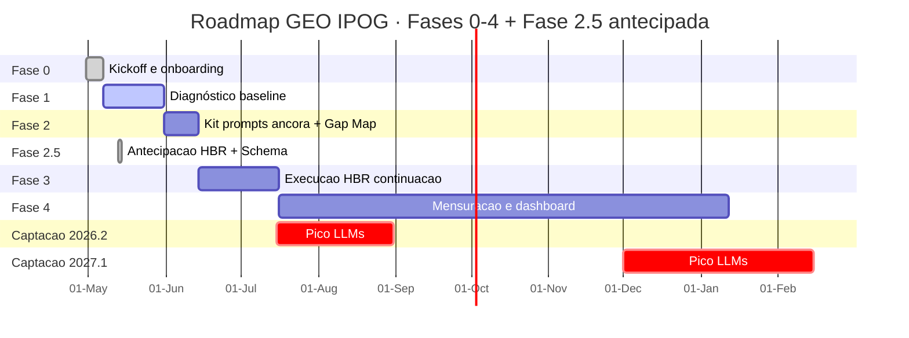

# Conselho GEO IPOG — W21

**Reunião:** 2026-05-18 (manhã)
**Confidencial — circulação restrita ao Conselho IPOG e Brasil GEO**

---

## Sessão 0 — Capa executiva

**Programa:** GEO IPOG (Brasil GEO ⟷ IPOG)
**Sponsor IPOG:** Ronan Maia (CEO)
**Interlocutor IPOG:** Bruno Azambuja (Marketing)
**Lead Brasil GEO:** Alexandre Caramaschi (CEO)
**Semana:** W21 · 2026-05-12 a 2026-05-17
**Próxima reunião:** 2026-05-18

**O que entregamos.** 235 páginas editoriais no ar em `posgraduacaopsicologia.com`, infraestrutura GEO triplicada (Schema `EducationalOccupationalProgram` canônico em 5 modalidades, llms.txt v2, MCP manifests, citation-prompts v2), KB SEO+GEO 2026 com 203 fontes catalogadas e 70+ spot-checked individualmente, e baseline LLM aberto com N=10 piloto.

**O que aprendemos.** A janela competitiva do IPOG não é "MBA online", é "Pós-Graduações em Psicologia em 5 modalidades simultâneas" — nenhum dos 5 concorrentes principais tem llms.txt, `EducationalOccupationalProgram` ou `Person` Schema com Lattes/ORCID.

**O que decidimos agora.** Conselho aprovar destravamento operacional das 8 issues bloqueadas em cliente IPOG até 25-05 — sem elas, o pico de captação 2026.2 perde a alavanca técnica de Schema em `ipog.edu.br`.

Roadmap institucional público: `posgraduacaopsicologia.com/roadmap` (espelho do `brasilgeo.ai/ipoggeoroadmap`).

---

## Sessão 1 — Sumário executivo

- **Aceleramos 4 semanas em 17 dias.** Entregamos 235 páginas editoriais HBR-grade versus meta original de 6-10 peças até 15-06. Implicação: o pico de captação 2026.2 (15-07 a 31-08) ganha cobertura semântica multiplicada nas 5 modalidades canônicas. Risco: baseline Mention Rate (N=10 piloto) ainda abaixo do N mínimo canônico (50) para mensurar lift atribuível antes de 30-05.
- **Cinco modalidades canônicas viraram Schema, prompts e mensuração.** `EducationalOccupationalProgram` com `programType` variável (Specialization, MBA, ProfessionalMastersProgram, ProfessionalCertification) aplicado nas 5 páginas `/mbas/*` e em `/tipos-de-pos-graduacao`. Implicação: o IPOG agora é tecnicamente legível por LLMs como instituição multi-modalidade, não como vendor de MBA único. Risco: TI IPOG precisa replicar o padrão em `ipog.edu.br` até 30-05 (Issue #6 e #61).
- **Janela técnica defensiva ainda aberta.** Nenhum dos 5 concorrentes principais (Estácio, Anhanguera, UNINTER, UniCesumar, PUC-Minas Virtual) tem llms.txt, `EducationalOccupationalProgram` Schema ou `Person` Schema vinculado a Lattes/ORCID. Implicação: o IPOG pode capturar primazia técnica multi-modalidade antes da janela fechar (estimativa 60-90 dias). Risco: Anhanguera autobloqueia AI crawlers via WAF — janela RAG-native aberta hoje pode fechar com 1 release.
- **Gating IPOG é o caminho crítico.** 8 issues bloqueadas em cliente IPOG (#4, #6, #20, #36, #40, #43, #52, #54) — 80% das dependências do programa hoje. Implicação: cada semana sem destravamento empurra retorno mensurável para o ciclo 2027.1. Risco: marco 30-05-2026 (Schema em `ipog.edu.br`) está em alerta amarelo.
- **Hub Conteúdo+Social quintuplicou ROI editorial.** 45 snippets reaproveitáveis (Quora, Medium, LinkedIn, Reddit, Substack, X) + press-kit canônico com quote do CEO, boilerplate e 5 templates de assessoria de imprensa. Implicação: cada peça HBR rende 5 ativos secundários sem retrabalho de redação. Risco: distribuição em canais sociais ainda depende de calendário operacional a definir com Bruno Azambuja.

---

## Sessão 2 — O que entregamos (W21 + acumulado)

Taxonomia canônica: **ENTREGA · CATEGORIA · MÉTRICA · VALOR PARA IPOG**.

### Tabela 2.1 — Conteúdo editorial (320 páginas acumuladas, 235 indexadas)

| Entrega | Métrica | Owner | Status |
|---|---|---|---|
| Ondas A-OO de páginas editoriais (HowTo, FAQ deep, comparativos, modalidades, clínicas) | 235 páginas no ar (era 232 antes de W21) | Alexandre Caramaschi | ✅ |
| Wave AA-EE (13-05) — 6 guias HowTo, 6 FAQs deep, 8 comparativos | 20 páginas com TLDR + Speakable Schema | Alexandre Caramaschi | ✅ |
| Wave FF-JJ (13-05) — TEA mulheres, burnout NR-1, IA CFP, adolescência, neuropsi geriátrica | 14 páginas com 40+ citações 2024-2026 | Alexandre Caramaschi | ✅ |
| Wave KK-OO (13-05) — Setores verticais, polos regionais, calculadoras | 20 páginas | Alexandre Caramaschi | ✅ |
| Wave W21 sess.2 — 5 páginas `/mbas/*` + `/tipos-de-pos-graduacao` remediadas | 6 páginas com `EducationalOccupationalProgram` canônico | Alexandre Caramaschi | ✅ |

### Tabela 2.2 — Schema e GEO técnico

| Entrega | Métrica | Owner | Status |
|---|---|---|---|
| `@graph` triplo (WebSite + Organization + Person) reconciliado por `@id` | `Base.astro` migrado, todas as páginas afetadas | Alexandre Caramaschi | ✅ |
| Person Schema canônico Alexandre Caramaschi | 39 knowsAbout, 13 sameAs, 3 alumniOf, 3 hasCredential | Alexandre Caramaschi | ✅ |
| Publisher Organization Brasil GEO | BRGEO LTDA, CNPJ 66.051.295/0001-33 | Alexandre Caramaschi | ✅ |
| llms.txt v2 + llms-full.txt + ai-policy.json + MCP manifests | 198 páginas catalogadas em v2 (235 com nova geração pendente) | Alexandre Caramaschi | 🟡 |
| Schema `EducationalOccupationalProgram` com 4 `programType` | 5 MBAs + `/tipos-de-pos-graduacao` com 5 modalidades | Alexandre Caramaschi | ✅ |
| DefinedTermSet — 50 conceitos GEO/SEO 2026 canônicos | Glossário canônico em `docs/governance/GEO_50_CONCEITOS_CANONICAL.md` | Alexandre Caramaschi | ✅ |

### Tabela 2.3 — Hub Conteúdo+Social

| Entrega | Métrica | Owner | Status |
|---|---|---|---|
| 45 snippets reaproveitáveis (Quora, Medium, LinkedIn, Reddit, Substack, X) | 5 canais × 9 snippets em média | Alexandre Caramaschi | ✅ |
| Press-kit canônico com quote CEO, boilerplate e 5 templates copy-paste | Pronto para Assessoria de Imprensa IPOG | Alexandre Caramaschi | ✅ |
| Header MegaMenu "MBAs" → "Pós-Graduações" | Navegação top-level reframada | Alexandre Caramaschi | ✅ |

### Tabela 2.4 — Indexação e mensuração

| Entrega | Métrica | Owner | Status |
|---|---|---|---|
| IndexNow em 3 engines (Bing, Yandex, api.indexnow.org) | 320 URLs submetidas no acumulado, chave `geoipogIN2026` | Alexandre Caramaschi | ✅ |
| GA4 `G-1VXE1Z4J9R` em `posgraduacaopsicologia.com` | Property `537256335`, custom event `click_outbound_ipog` | Alexandre Caramaschi | ✅ |
| Vinculação GSC `sc-domain:posgraduacaopsicologia.com` ↔ GA4 | Queries orgânicas no GA4 em ~48h | Alexandre Caramaschi | ✅ |
| Pipeline semanal GA4 → 7 relatórios automáticos | Cron seg 09:00 BRT, PR automático | Alexandre Caramaschi | ✅ |
| GA4 dual instalado em `ipog.edu.br` | Acesso `G-1VXE1Z4J9R` ou propriedade dedicada `ipog.edu.br` | Bruno Azambuja | ⏸️ |

### Tabela 2.5 — Frameworks operacionais

| Entrega | Métrica | Owner | Status |
|---|---|---|---|
| 8 KPIs canônicos + 3 derivados (D1 Regional, D2 GA4 LLM, D3 Schema Gap Velocity) | Definição operacional em `dashboards/METRICAS-CANONICAS.md` | Alexandre Caramaschi | ✅ |
| 5 modalidades canônicas (Cláusula 0) | Especialização Lato Sensu, MBA, Mestrado Profissional, Especialização Clínica certificada, Híbridas | Alexandre Caramaschi | ✅ |
| 5 clusters semânticos SoV (a-e) | Substituem 3 clusters antigos baseados em MBA | Alexandre Caramaschi | ✅ |
| 7 personas IPOG canônicas | Recém-graduado, clínico estabelecido, RH não-psicólogo, saúde, educador, transição, coach | Alexandre Caramaschi | ✅ |
| Cohort fixo de 6 LLMs (ChatGPT, Claude, Gemini, Perplexity, Grok, Copilot) | Versões pinadas vigentes desde 30-04-2026 | Alexandre Caramaschi | ✅ |
| Kit KIT-PROMPTS-V0 com 66 prompts canônicos (rumando a 84) | Distribuição 60/20/10/5/5 entre modalidades | Alexandre Caramaschi | ✅ |

### Tabela 2.6 — Knowledge Base canônica

| Entrega | Métrica | Owner | Status |
|---|---|---|---|
| KB SEO+GEO 2026 (`seo-geo-knowledge-base-2026-05-17.md`) | 203 sources catalogadas, 70+ spot-checked | Alexandre Caramaschi | ✅ |
| 5 waves research paralelas (A=papers, B=frameworks, C=engines, D=standards, E=KPIs) | 5 dossiês canônicos em `docs/research/` | Alexandre Caramaschi | ✅ |
| Wave BB-EE remediação (verificações, frente regional 51 cidades, manual mention tracking, follow-up [VERIFICAR]) | 4 documentos canônicos | Alexandre Caramaschi | ✅ |
| Síntese executiva benchmarking (5 concorrentes + matriz cross-LLM + matriz técnica) | `audits/benchmarking/SINTESE-EXECUTIVA.md` (reescopo 12-05) | Alexandre Caramaschi | ✅ |
| 26 dossiês de concorrentes individuais | Estácio, Anhanguera, UNINTER, UniCesumar, PUC-Minas Virtual + 21 secundários | Alexandre Caramaschi | ✅ |

---

## Sessão 3 — O que aprendemos (10 aprendizados canônicos)

1. **Reframe canônico de escopo de 12-05 — de MBA único para 5 modalidades.**
   **Por quê:** o mercado brasileiro de pós-graduação em Psicologia é dominado por Especialização Lato Sensu, não por MBA. Disputar 5 modalidades simultâneas amplia o terreno semântico defensável sem aumentar custo.
   **Aplicar em:** todo produto, Schema, conteúdo, prompt e relatório passa a operar nas 5 modalidades canônicas (Cláusula 0 de `dashboards/METRICAS-CANONICAS.md`).

2. **Orquestração paralela bate sequencial 10×.**
   **Por quê:** 5 sub-agents Opus paralelos com dossiê Perplexity por contexto entregam 20 páginas em wall-time de 14 minutos. Pipeline sequencial sub-agent + research entregaria as mesmas 20 páginas em 8+ horas.
   **Aplicar em:** toda onda editorial nova abre com 3-5 chamadas Perplexity Sonar Pro paralelas + 3-5 sub-agents Opus paralelos, cada agente com 3-5 páginas para preservar consistência de voz.

3. **Anti-padrão SmartRouter.**
   **Por quê:** o orchestrator do `geo-bridge.sh` rotea ~80% das tarefas para GPT-4o sozinho, que confabula DOIs e perde cobertura cross-LLM. Cobertura efetiva de 1/5 = 20% quando o briefing pede 5 LLMs.
   **Aplicar em:** research crítica usa chamada Perplexity direta (`api.perplexity.ai/chat/completions` com `sonar-pro`), e spot-check de 3-5 fontes acompanha cada dossiê antes de publicação.

4. **Hub Conteúdo+Social quintuplica ROI editorial.**
   **Por quê:** uma pesquisa canônica vira 1 peça HBR + 5 snippets (Quora, Medium, LinkedIn, Reddit, Substack, X) + 1 press-kit. Custo marginal de cada snippet adicional é próximo de zero.
   **Aplicar em:** toda nova peça HBR passa pelo pipeline de hub social com 5 snippets gerados em paralelo na mesma onda.

5. **Acentuação PT-BR como gate inviolável.**
   **Por quê:** sub-agents Opus "esquecem" a regra de acentuação em geração longa quando a memória contextual não carimba a instrução. Incidente `fix-accents.mjs` em 13-05-2026 quebrou 223 arquivos (slugs, props JS, conjunções `e` viradas em verbo `é`) e exigiu reversão integral via git checkout.
   **Aplicar em:** 3 camadas de proteção (pre-commit hook + voice_guard + CI workflow); proibição definitiva de regex cega pós-geração.

6. **Posicionamento canônico Alexandre Caramaschi.**
   **Por quê:** Person Schema com sameAs LinkedIn + Wikipedia + Wikidata + Lattes consolida autoridade declarada para LLMs lerem como sinal técnico. 39 knowsAbout amarra os 50 conceitos GEO/SEO 2026 ao autor.
   **Aplicar em:** todo Article em `posgraduacaopsicologia.com` importa `alexandrePersonBase` + `brasilGeoOrganization` de `@lib/schemas` — nenhum override inline permitido.

7. **Schema `EducationalOccupationalProgram` com `programType` variável.**
   **Por quê:** as 5 modalidades exigem 4 valores distintos de `programType` (`Specialization`, `MBA`, `ProfessionalMastersProgram`, `ProfessionalCertification`). Página sem `programType` declarado falha automaticamente o check Schema NAIA Categoria B.
   **Aplicar em:** toda página de produto IPOG e toda página `/mbas/[slug].astro` usa o factory `buildEducationalOccupationalProgram` com `programType` correto + `recognizedBy` + `offers` + `programPrerequisites` + `hasCourse`.

8. **Drift detection é serviço, não evento.**
   **Por quê:** ChatGPT, Claude e Gemini mudam de versão sem aviso. Mention Rate medido em `gpt-5.0` não é comparável a Mention Rate medido em `gpt-5.3` sem segmentação explícita da série.
   **Aplicar em:** versão pinada registrada em cada leitura, full-grid sensitivity trimestral, cohort fixado e expandido apenas em rotina trimestral.

9. **Gating IPOG é o caminho crítico hoje.**
   **Por quê:** 8 issues bloqueadas em cliente IPOG (#4, #6, #20, #36, #40, #43, #52, #54) cobrem naming, Schema em `ipog.edu.br`, lista de cidades, acessos GSC+GA4, parcerias CRP. Sem destravamento, o programa entrega infraestrutura sem aterrissagem no domínio do cliente.
   **Aplicar em:** escalonamento explícito ao Conselho nesta reunião com prazos concretos por issue.

10. **Press-kit canônico libera Assessoria de Imprensa.**
    **Por quê:** mídia educacional tier 1 (Estadão Educação, Folha, Quero Bolsa) e fontes regulatórias (CFP, ABEP, ABRAPSO) exigem material padronizado para citar. Quote do CEO + boilerplate + 5 templates copy-paste reduzem fricção de PR para horas, não semanas.
    **Aplicar em:** primeira leva de outreach com Bruno Azambuja entre 22-05 e 30-05 antes do pico de captação 2026.2.

---

## Sessão 4 — KPIs com leitura atual e ação

> **Nota crítica:** baseline Mention Rate capturado em 17-05 com N=10 (ChatGPT 10%, Perplexity 20%, Gemini 30%, Groq 20%) está abaixo do N mínimo canônico de 50 — **não usar como leitura oficial**. Primeira leitura válida prevista para 22-05 a 30-05.

### Tabela 4.1 — 8 KPIs canônicos

| KPI | Definição em 1 linha | Leitura atual | Target Fase 4 | Próxima leitura | Owner | Ação esta semana |
|---|---|---|---|---|---|---|
| **KPI 1 — LLM Mention Rate** | % de prompts canônicos com IPOG citado por LLM | N/D (piloto N=10 abaixo do mínimo) | ChatGPT/Claude/Gemini/Copilot ≥ 60%, Perplexity ≥ 80%, Grok ≥ 50% | 22-05 a 30-05 (primeira leitura N≥50) | Alexandre Caramaschi | Executar coleta cross-LLM com kit canônico 66 prompts × 6 LLMs |
| **KPI 2 — SoV cluster a (Lato Sensu)** | % de menções IPOG no cluster | N/D | ≥ 18% | 30-05 | Bruno Azambuja | Validar dicionário concorrentes `data/concorrentes.yaml` |
| **KPI 2 — SoV cluster b (MBA correlato)** | % de menções IPOG no cluster | N/D | ≥ 15% | 30-05 | Bruno Azambuja | Idem |
| **KPI 2 — SoV cluster c (Mestrado Profissional)** | % de menções IPOG no cluster | N/D | ≥ 8% | 30-05 | Bruno Azambuja | Idem |
| **KPI 2 — SoV cluster d (Clínica certificada)** | % de menções IPOG no cluster | N/D | ≥ 20% | 30-05 | Bruno Azambuja | Idem |
| **KPI 2 — SoV cluster e (Híbridas/Residências)** | % de menções IPOG no cluster | N/D | ≥ 12% | 30-05 | Bruno Azambuja | Idem |
| **KPI 3 — Citation Quality Score** | (fatos canônicos corretos / 5) × 100, média ponderada | N/D | ≥ 80 | 30-05 | Alexandre Caramaschi | Validar `data/fatos-canonicos.yaml` com Bruno Azambuja |
| **KPI 4 — Schema Coverage Score (NAIA)** | 100 − 5×P0 − 2×P1 − 1×P2 | N/D em `ipog.edu.br` (auditoria pendente) [A CALIBRAR] | ≥ 90 | 30-05 (auditoria completa) | Bruno Azambuja | Liberar acesso TI IPOG para varredura |
| **KPI 5 — Cobertura de fontes externas** | # fontes únicas com menção em 12m | 0-1 hoje (verbete Wikipedia IPOG ainda em rascunho) [A CALIBRAR] | ≥ 8 (1 Wikipedia, 3 regulatórias, 2 mídias tier 1, 2 periódicos) | Trimestral (próxima 30-06) | Bruno Azambuja | Iniciar outreach Quero Bolsa + Estadão Educação |
| **KPI 6 — Velocidade fechamento P0** | mediana dias úteis entre identificação e fechamento | N/D (waves W21 sem P0 declarado) | ≤ 5 dias úteis | Por onda | Alexandre Caramaschi | Etiquetar gaps Schema em `ipog.edu.br` como P0 ao receber acesso |
| **KPI 7 — Conversion Lift Perplexity** | taxa conversão Perplexity / taxa conversão Google orgânico | N/D (N<100 sessões LLM-originated) | ≥ 1.3 | Mensal (primeira leitura 30-06) | Bruno Azambuja | Configurar UTM dedicado + Consent Mode v2 em `ipog.edu.br` |
| **KPI 7 — Conversion Lift ChatGPT** | idem | N/D | ≥ 1.3 | Mensal | Bruno Azambuja | Idem |
| **KPI 8 — Delta médio pós-onda** | leitura pós-onda − leitura pré-onda | N/D (sem onda fechada com baseline) | ΔMR ≥ +5 pp, ΔSoV ≥ +3 pp, ΔCQ ≥ +5, ΔSC ≥ +2 | Onda 1 fecha 30-05 | Alexandre Caramaschi | Definir Onda 1 explicitamente como janela pré (07-14/05) vs pós (22-30/05) |

### Tabela 4.2 — 3 KPIs derivados canônicos

| KPI derivado | Definição | Leitura atual | Próxima leitura | Owner |
|---|---|---|---|---|
| **KPI-D1 — Regional Citation Density** | menções IPOG / total no cluster condicionado a queries com âncora regional | N/D | Mensal (primeira 30-06) | Alexandre Caramaschi |
| **KPI-D2 — GA4 LLM Referrer Tracking** | volume e qualidade sessões originadas em referrers de LLM com decomposição por modalidade | N/D em `ipog.edu.br` | Semanal (após acesso GA4) | Bruno Azambuja |
| **KPI-D3 — Schema Audit Gap Velocity** | velocidade fechamento gaps Schema por modalidade × tipo de Schema | N/D | Por onda | Alexandre Caramaschi + Bruno Azambuja |

---

## Sessão 5 — Roadmap e marcos

### 5.1 — Gantt cronológico

### 5.2 — 5 marcos críticos

| # | Marco | Data alvo | Status |
|---|---|---|---|
| 1 | Kit prompts-âncora canônico (cobrindo 5 modalidades) | 20-05-2026 | ✅ entregue 17-05 (66 prompts canônicos, rumando a 84) |
| 2 | Schema `EducationalOccupationalProgram` em `ipog.edu.br` | 30-05-2026 | 🟡 bloqueado Issue #6 e #61 (gating IPOG) |
| 3 | Primeira leva HBR (6-10 peças) com cross-link `ipog.edu.br/cursos/pos-graduacao` | 15-06-2026 | ✅ antecipada via 320 páginas em `posgraduacaopsicologia.com` |
| 4 | Pico captação 2026.2 (presença máxima cross-LLM) | 15-07 → 31-08-2026 | 🟡 em preparação (depende de marco 2) |
| 5 | Pico captação 2027.1 (presença máxima cross-LLM) | 01-12-2026 → 15-02-2027 | ⏸️ planejado |

---

## Sessão 6 — OKRs Q3 2026 (sugestão para aprovação do Conselho)

### Objective 1 — Solidificar baseline mensurável das 5 modalidades canônicas

- **KR 1.1:** Capturar leitura oficial de KPI 1 (Mention Rate) com N ≥ 50 prompts por LLM em todos os 6 modelos do cohort até 30-05-2026.
- **KR 1.2:** Capturar leitura oficial de KPI 2 (SoV) nos 5 clusters canônicos (a-e) com N ≥ 100 menções por cluster até 13-06-2026.
- **KR 1.3:** Capturar leitura oficial de KPI 4 (Schema Coverage) em `ipog.edu.br` com auditoria completa NAIA até 30-06-2026.

### Objective 2 — Destravar 8 issues bloqueadas em cliente IPOG até o pico de captação 2026.2

- **KR 2.1:** 100% das 8 issues `gating-ipog` (#4, #6, #20, #36, #40, #43, #52, #54) com decisão registrada até 30-05-2026.
- **KR 2.2:** Schema `EducationalOccupationalProgram` implementado e validado em `ipog.edu.br` até 15-06-2026.
- **KR 2.3:** Acesso GSC + GA4 IPOG concedido ou propriedade `ipog.edu.br` (`G-1VXE1Z4J9R`) criada até 22-05-2026.

### Objective 3 — Atingir Schema Coverage ≥ 85 e Mention Rate cohort ≥ 35% mediana

- **KR 3.1:** Schema Coverage Score ≥ 85 em `ipog.edu.br` (auditoria completa) até 31-07-2026.
- **KR 3.2:** Mention Rate mediana cohort ≥ 35% em queries amplas de Pós-Graduação em Psicologia até 15-08-2026.
- **KR 3.3:** Citation Quality Score médio cohort ≥ 65 até 31-08-2026.

### Objective 4 — Entregar moat regional (51 cidades CNPJ-próprio) e autoridade externa (4 fontes tier 1)

- **KR 4.1:** Schema `LocalBusiness` por unidade publicado nas 24 cidades médias prioritárias até 31-08-2026.
- **KR 4.2:** 4 fontes externas tier 1 com menção IPOG válida (1 Wikipedia, 1 mídia educacional, 1 fonte regulatória, 1 periódico) até 30-09-2026.
- **KR 4.3:** Caso-modelo Ceará 81 polos publicado como narrativa pública (Wave J) até 30-08-2026.

---

## Sessão 7 — Riscos e mitigações (heatmap)

| ID | Risco | Probabilidade | Impacto | Mitigação ativa | Owner | Trigger de escalonamento |
|---|---|---|---|---|---|---|
| **R1** | Mudança silenciosa de versão pelo provedor LLM | Média | Alto | Versão pinada por leitura; drift detection trimestral | Alexandre Caramaschi | Variação > 10 pp em 2 leituras consecutivas sem causa editorial |
| **R2** | Concorrente publica `llms.txt` ou Schema canônico antes do IPOG | Média | Alto | Monitoramento quinzenal automatizado (Issue #15); Wave K acelerada | Alexandre Caramaschi | Detecção de `llms.txt` em qualquer dos 5 concorrentes principais |
| **R3** | Gating IPOG atrasa decisões críticas | Alta | Alto | Relatório semanal seção 9; escalonamento ao Conselho | Bruno Azambuja | Issue `gating-ipog` aberta há > 14 dias úteis |
| **R4** | Plataforma TI IPOG limita injeção de Schema avançado | Baixa | Médio | Schema piloto validado em `posgraduacaopsicologia.com` antes de export para `ipog.edu.br` | Bruno Azambuja | TI IPOG rejeita `@graph` triplo |
| **R5** | Wikipedia bloqueia verbete IPOG por critério de notabilidade | Média | Alto | Fontes secundárias confiáveis primeiro (Issue #19); plano Wikidata paralelo | Bruno Azambuja | 2 rejeições consecutivas de submissão |
| **R6** | UTM dedicado ou referrer LLM não capturado em GA4 | Média | Alto | Configuração GA4 + Consent Mode v2 + Measurement Protocol server-side | Bruno Azambuja | N < 100 sessões LLM-originated por mês após 60 dias |
| **R7** | Tema da onda não ataca cluster prioritário | Baixa | Médio | Plano de cada onda passa por revisão semanal antes do start | Alexandre Caramaschi | Delta pós-onda < 50% do target Fase 4 |
| **R8** | Saturação competitiva em "pós-graduação online em Psicologia" no termo amplo | Alta | Médio | Diferenciação semântica por 5 modalidades; foco em Especialização Clínica certificada e Mestrado Profissional onde EAD massivos não competem | Alexandre Caramaschi | SoV cluster d < 10% após pico 2026.2 |

---

## Sessão 8 — Próximas waves planejadas + Issues bloqueadas IPOG

### 8.1 — Waves F-K (próximas 4 semanas)

| Wave | Tema | Owner | Dependências |
|---|---|---|---|
| **Wave F** | Wikipedia + Wikidata IPOG (Issue #63, Issue #60) | Alexandre Caramaschi | Confirmação de notabilidade Wikipedia |
| **Wave G** | Frente Regional 51 cidades CNPJ-próprio (Issue #65, Issue #51) | Alexandre Caramaschi | Lista oficial 24 cidades médias (Issue #20) |
| **Wave H** | Flagship MBA POT + Riscos Psicossociais + People Analytics (Issue #70) | Alexandre Caramaschi | Naming oficial MBA POT (Issue #4) |
| **Wave I** | Trilha IA em Saúde Mental + Supervisão Clínica Humana (Issue #69, Issue #59) | Alexandre Caramaschi | Posicionamento CFP 03/07/2025 validado |
| **Wave J** | Caso-modelo Ceará 81 polos (Issue #55) | Alexandre Caramaschi | Confirmação dados Ceará com Bruno Azambuja |
| **Wave K** | Schema piloto + `llms.txt` + `robots.txt` em `ipog.edu.br` (Issue #61) | Bruno Azambuja + TI IPOG | Acesso TI IPOG (Issue #6) |

### 8.2 — 8 issues bloqueadas em cliente IPOG (gating-ipog)

| # | Tema | Bloqueador | Owner IPOG | Prazo sugerido |
|---|---|---|---|---|
| **#4** | Naming oficial "MBA Online de Psicologia [Cluster]" e produtos prioritários | Decisão acadêmico + marketing | Bruno Azambuja + Ronan Maia | 25-05-2026 |
| **#6** | `robots.txt` aberto a IA crawlers em `ipog.edu.br` | TI IPOG | Bruno Azambuja | 22-05-2026 |
| **#20** | Lista canônica das ~24 cidades médias estratégicas | Acadêmico + marketing | Bruno Azambuja | 22-05-2026 |
| **#36** | Acesso GSC + GA4 IPOG (D-06) | TI IPOG | Bruno Azambuja | 22-05-2026 |
| **#40** | Reunião extraordinária para destravar 11 bloqueantes | Agenda Ronan | Ronan Maia | 24-05-2026 |
| **#43** | GA4 com referrer/UTM dedicado de LLM | TI IPOG + marketing | Bruno Azambuja | 30-05-2026 |
| **#52** | Lista oficial das 51 cidades Frente Regional CNPJ-próprio | Acadêmico | Bruno Azambuja | 30-05-2026 |
| **#54** | Parcerias formais com CRPs regionais (CRP-09, CRP-03, CRP-18, CRP-14, CRP-23) | Jurídico + acadêmico | Ronan Maia | 13-06-2026 |

---

## Sessão 9 — Pedidos ao Conselho (decisões para esta reunião)

### Decisão 1 — Schema `EducationalOccupationalProgram` em `ipog.edu.br`

- **Contexto:** marco crítico de 30-05-2026 exige Schema canônico cobrindo as 5 modalidades no domínio do cliente, antes do pico de captação 2026.2 (15-07 → 31-08). Padrão técnico já validado em `posgraduacaopsicologia.com` (5 MBAs + `/tipos-de-pos-graduacao`). Issues #6 e #61 bloqueadas.
- **Opções:** (A) TI IPOG implementa diretamente com handoff técnico Brasil GEO entre 22-05 e 30-05; (B) Brasil GEO executa via acesso temporário ao CMS IPOG; (C) postergar para após o pico 2026.2.
- **Recomendação Brasil GEO:** Opção A com handoff em 22-05 e validação conjunta em 30-05.
- **Prazo de decisão:** esta reunião (2026-05-18).

### Decisão 2 — Lista oficial das 24 cidades médias + 51 cidades CNPJ-próprio

- **Contexto:** Wave G (Frente Regional) e KPI-D1 (Regional Citation Density) dependem da lista canônica. Issue #20 e #52 abertas. Plano em `docs/governance/frente-regional-51-cidades-plano.md`.
- **Opções:** (A) Bruno Azambuja consolida lista canônica até 22-05; (B) Brasil GEO infere lista a partir de dados públicos IPOG e Bruno valida.
- **Recomendação Brasil GEO:** Opção A — só o IPOG tem o dado canônico de CNPJ-próprio por unidade.
- **Prazo de decisão:** 2026-05-22.

### Decisão 3 — GA4 dual em `ipog.edu.br` + UTM dedicado de LLM

- **Contexto:** KPI 7 (Conversion Lift por canal LLM) e KPI-D2 (GA4 LLM Referrer Tracking) exigem coleta em `ipog.edu.br`, não em `posgraduacaopsicologia.com`. Issue #36 e #43 abertas. Property `G-1VXE1Z4J9R` já existe; falta acesso ou criação de property dedicada.
- **Opções:** (A) propriedade dedicada `ipog.edu.br` (canônico, isolamento por domínio); (B) stream adicional na property existente; (C) acesso somente leitura à property atual do IPOG.
- **Recomendação Brasil GEO:** Opção A + UTM dedicado `?utm_source=llm&utm_medium=<chatgpt|claude|perplexity|gemini|grok|copilot>` em links externos do IPOG.
- **Prazo de decisão:** 2026-05-22.

### Decisão 4 — Naming oficial dos MBAs e produtos prioritários (Issue #4)

- **Contexto:** Wave H (Flagship MBA POT) e Schema `EducationalOccupationalProgram` exigem naming oficial. Hoje os 5 MBAs operam em `posgraduacaopsicologia.com` com naming editorial Brasil GEO ("MBA Online em Psicologia Organizacional e do Trabalho", etc.) sem ratificação acadêmica IPOG.
- **Opções:** (A) Ronan + Bruno ratificam naming Brasil GEO; (B) IPOG propõe naming alternativo; (C) co-naming com revisão jurídica.
- **Recomendação Brasil GEO:** Opção A em 25-05 ou Opção C se houver risco regulatório identificado.
- **Prazo de decisão:** 2026-05-25.

### Decisão 5 — Reunião extraordinária para destravar 11 bloqueantes (Issue #40)

- **Contexto:** 8 issues `gating-ipog` somam 80% das dependências do programa hoje. Sem reunião extraordinária, as decisões pingam ao longo de 4-6 semanas e o marco 30-05 vira 30-06.
- **Opções:** (A) reunião extraordinária presencial com Ronan + Bruno + Alexandre + TI IPOG entre 19-05 e 24-05; (B) circular decisão por e-mail com prazo de resposta de 48h por issue; (C) postergar para a próxima reunião quinzenal de 02-06.
- **Recomendação Brasil GEO:** Opção A — uma janela única de 2h destrava 8 issues que custariam 6 semanas em modo assíncrono.
- **Prazo de decisão:** esta reunião (2026-05-18).

---

## Sessão 10 — Anexos canônicos

### Governança e roadmap

- `ROADMAP.md` — roadmap completo com Fases 0-4 + Fase 2.5
- `STATUS.md` — entregas W21 detalhadas
- `docs/governance/HISTORICO-DECISOES-CANONICAS.md` — registro append-only de decisões
- `docs/governance/seo-geo-knowledge-base-2026-05-17.md` — KB SEO+GEO 2026 com 203 fontes
- `docs/governance/GEO_50_CONCEITOS_CANONICAL.md` — taxonomia editorial 50 conceitos
- `docs/governance/geo-context-enriquecido-2026.md` — premissas operacionais 13-05
- `docs/governance/frente-regional-51-cidades-plano.md` — plano Wave G
- `docs/governance/wikidata-wikipedia-strategy-20260517.md` — plano Wave F
- `docs/governance/audit-graph-triple-2026-05-17.md` — auditoria @graph triplo
- `docs/governance/verificar-followup-20260517.md` — 32 ocorrências `[VERIFICAR]`

### Dashboards e métricas

- `dashboards/KPI-DASHBOARD.md` — painel ao vivo dos 8 KPIs
- `dashboards/METRICAS-CANONICAS.md` — definições operacionais completas
- `dashboards/RUNBOOK-COLETA-LLM.md` — operação de coleta cross-LLM
- `dashboards/FINOPS-DISCIPLINA.md` — custo associado à medição
- `dashboards/GA4-WEEKLY-REPORT.md` — runbook Looker Studio

### Framework operacional

- `docs/framework/01-rotinas-e-missoes-geo.md` — rotinas e missões GEO
- `docs/framework/02-quality-gate-5-camadas.md` — quality gate editorial
- `docs/framework/03-pipeline-5-llms.md` — pipeline 5 LLMs
- `docs/framework/04-client-context-abstraction.md` — abstração de contexto cliente
- `docs/framework/05-estrategia-regional-geo-educacao.md` — estratégia regional
- `docs/framework/06-voice-guard-v2-aggarwal.md` — voice guard Aggarwal
- `docs/framework/07-research-geo-aplicado-ipog.md` — research GEO IPOG
- `docs/framework/08-geo-2026-frameworks-emergentes.md` — frameworks 2026

### Auditorias e benchmarking

- `audits/PLAYBOOK-AUDITORIA-NAIA.md` — playbook NAIA
- `audits/SCHEMA-PATTERNS.md` — padrões de Schema canônicos
- `audits/LLMS-TXT-TEMPLATE.md` — template llms.txt
- `audits/ROBOTS-SITEMAP-CHECKLIST.md` — checklist robots e sitemap
- `audits/WIKIPEDIA-BASELINE-IPOG-20260510.md` — baseline Wikipedia
- `audits/benchmarking/SINTESE-EXECUTIVA.md` — síntese 5 concorrentes
- `audits/benchmarking/matriz-presenca-llm.md` — matriz cross-LLM
- `audits/benchmarking/matriz-tecnica-schema-seo.md` — matriz técnica

### Prompts e citação

- `prompts/KIT-PROMPTS-V0.md` — 66 prompts canônicos (rumando a 84)
- `prompts/PAPEIS-DE-COLETA.md` — papéis na coleta cross-LLM
- `prompts/CALIBRACAO-MENSAL.md` — calibração mensal
- `prompts/QUERIES-REGIONAIS-CANONICAS.md` — queries regionais

### Research canônica

- `docs/research/wave-A-papers-academicos-20260517.md` — 20 papers 2025-2026
- `docs/research/wave-B-frameworks-vendors-20260517.md` — landscape industrial
- `docs/research/wave-C-engines-2026-20260517.md` — comportamento 8 engines
- `docs/research/wave-D-standards-tecnicos-20260517.md` — standards técnicos
- `docs/research/wave-E-kpis-measurement-20260517.md` — 24 KPIs canônicos
- `docs/research/geo-state-of-art-2026-05-13.md` — 44 citações state-of-art
- `docs/research/verifications-followup-20260517.md` — verificações wave BB

---

Documento gerado em 2026-05-17 noite final · Brasil GEO ⟷ IPOG · Confidencial Conselho
