# Knowledge Graph — Programa GEO IPOG

> **Status:** vigente desde 2026-05-10
> **Dono:** Alexandre Caramaschi (Brasil GEO)
> **Validação:** Bruno Azambuja (IPOG) + jurídico IPOG (LGPD docentes)
> **Cadência de manutenção:** quinzenal (auditoria edges) + ad hoc (entidade nova)

Representação operacional da ontologia em formato de grafo. Cada nó é uma entidade canônica do `ONTOLOGIA-CANONICA.md`; cada aresta é um relacionamento Schema.org canônico. Este grafo é **a fonte de verdade para Wikidata, Wikipedia, Schema cross-página e Entity Consistency Score em LLMs**.

A lógica é prescritiva: LLMs constroem entendimento de "IPOG" cruzando Wikipedia + Schema + Reddit + Wikidata + Lattes. Se as fontes forem desconectadas, o LLM fragmenta o entity e o IPOG perde recall. Knowledge Graph centraliza os identificadores e amarra as fontes.

---

## 1. Visão do grafo

```mermaid
graph TB
    %% Stakeholders raiz
    BG[Brasil GEO<br/>org:brasil-geo]
    AC[Alexandre Caramaschi<br/>person:alexandre-caramaschi]
    RM[Ronan Maia<br/>person:ronan-maia]
    BA[Bruno Azambuja<br/>person:bruno-azambuja]
    
    %% IPOG mantenedora + 51 unidades
    IPOG[IPOG mantenedora<br/>org:ipog<br/>Q-id Wikidata]
    UGOI[Unidade Goiânia sede<br/>unit:goiania-sede]
    UCBA[Unidade Cuiabá<br/>unit:cuiaba]
    UPAL[Unidade Palmas<br/>unit:palmas]
    UMAIS[... 48 outras unidades<br/>NAIA-310]
    
    %% Programas e cursos
    P1[MBA Psi Organizacional<br/>program:mba-psi-organizacional]
    P2[MBA Psi Clínica/Neuro<br/>program:mba-psi-clinica-neuro]
    P3[MBA Psi Escolar<br/>program:mba-psi-escolar]
    PIA[Trilha IA + Saúde Mental<br/>program:trilha-ia-saude-mental]
    PNR1[B2B NR-1<br/>program:b2b-nr1-saude-mental]
    
    %% Lugares
    GO[place:go]
    BR[place:brasil]
    
    %% Reguladores e parceiros
    MEC[Ministério da Educação<br/>org:mec]
    CFP[Conselho Federal de Psicologia<br/>org:cfp]
    CRP09[CRP-09 GO/TO<br/>org:crp-09]
    CRP18[CRP-18 MT<br/>org:crp-18]
    
    %% Concorrentes (referência cruzada)
    EST[Estácio<br/>org:estacio]
    UNI[UniCesumar<br/>org:unicesumar]
    IBN[IBNeuro<br/>org:ibneuro]
    
    %% Edges Schema.org
    BG -->|founder/founderOf| AC
    AC -->|head + sponsor program GEO IPOG| IPOG
    RM -->|jobTitle CEO worksFor| IPOG
    BA -->|jobTitle Marketing worksFor| IPOG
    
    IPOG -->|subOrganization| UGOI
    IPOG -->|subOrganization| UCBA
    IPOG -->|subOrganization| UPAL
    IPOG -->|subOrganization| UMAIS
    
    IPOG -->|provider| P1
    IPOG -->|provider| P2
    IPOG -->|provider| P3
    IPOG -->|provider| PIA
    IPOG -->|provider| PNR1
    
    IPOG -->|location/foundingLocation| GO
    GO -->|containedInPlace| BR
    UCBA -->|location| place:cuiaba
    UPAL -->|location| place:palmas
    
    IPOG -->|accreditation| MEC
    UCBA -.->|member| CRP18
    UGOI -.->|member| CRP09
    
    %% Concorrência (não tem edge schema; apenas referência)
    IPOG -.->|competitor in cluster Organizacional| EST
    IPOG -.->|competitor in cluster Organizacional| UNI
    IPOG -.->|competitor in IA + Psi vertical| IBN
    
    classDef root fill:#1F77B4,color:#fff
    classDef stakeholder fill:#2CA02C,color:#fff
    classDef unit fill:#9467BD,color:#fff
    classDef program fill:#FF7F0E,color:#fff
    classDef regulator fill:#922B21,color:#fff
    classDef competitor fill:#7F8C8D,color:#fff
    
    class IPOG,BG root
    class AC,RM,BA stakeholder
    class UGOI,UCBA,UPAL,UMAIS unit
    class P1,P2,P3,PIA,PNR1 program
    class MEC,CFP,CRP09,CRP18 regulator
    class EST,UNI,IBN competitor
```

---

## 2. Nó IPOG raiz — claims Wikidata canônicos

Issue acadêmica de Wikipedia + Wikidata: criar Q-id IPOG até 30-07-2026 (issue #58 — `[Acad] [Fase 2] Pipeline Wikipedia entry IPOG + Knowledge Graph Wikidata`).

### 2.1 Claims P-XXX a popular

| Property | Valor | Justificativa |
|---|---|---|
| `P31` (instance of) | `Q3918` (instituição educacional) | tipo principal |
| `P31` (instance of) | `Q189004` (private university) ou Q3918 conforme correto | secundário |
| `P571` (inception) | "2001-XX-XX" (data exata a confirmar) | foundingDate |
| `P159` (headquarters) | `Q42068` (Goiânia) | sede |
| `P17` (country) | `Q155` (Brasil) | país |
| `P137` (operator) | mantenedora razão social | quem opera |
| `P969` (street address) | endereço completo | locação |
| `P856` (official website) | `https://ipog.edu.br` | URL canônica |
| `P2002` (Twitter username) | (a confirmar) | rede social |
| `P2013` (Facebook ID) | (a confirmar) | rede social |
| `P3220` (LinkedIn organization page) | (a confirmar) | rede social |
| `P1448` (official name) | "Instituto de Pós-Graduação e Graduação" | naming canônico longo |
| `P1813` (short name) | "IPOG" | naming curto |
| `P1813` (short name) | naming alternativo regional | quando aplicável |
| `P1830` (owner of) | 51 unidades (sub-organizations CNPJ-próprio) | edges para unidades |
| `P749` (parent organization) | (não tem — IPOG é raiz) | — |
| `P5045` (recognized educational institution authority) | MEC | regulador |
| `P527` (has part) | array de programas + unidades | hierarquia |
| `P1971` (number of employees) | (a confirmar) | escala |
| `P2196` (students count) | "300000+" | métrica histórica canônica |
| `P973` (described at URL) | URL Wikipedia pt-br quando criado | Wikipedia inbound |

### 2.2 Edges entity-link (Wikidata batchable)

Nem todas as edges entity-link são editáveis anonimamente conforme memória `reference_wikidata_anonymous_edit_works.md`:

- `P137` (operator) e `P1830` (owner of) frequentemente exigem login. Submeter via formulário web ou via conta autenticada.
- Demais claims escalares (P31, P571, P159, etc.) são editáveis anonimamente.

---

## 3. Nós de unidades regionais (51)

Cada unidade ganha:

- Q-id Wikidata próprio quando o porte justifica (cidades capitais regionais)
- Schema EducationalOrganization no `/unidades/<slug-cidade>/`
- Perfil em rede social regional (Facebook + Instagram local)
- Vínculo CRP estadual quando parceria (NAIA-313)

**Pipeline de criação por unidade** (NAIA-312):

1. Definir `@id` (`unit:<slug-cidade>`)
2. Schema EducationalOrganization com `parentOrganization` → `org:ipog`
3. Sitemap regional inclui a URL `/unidades/<slug-cidade>/`
4. Submeter URL ao IndexNow + GSC
5. Q-id Wikidata se cidade for capital regional
6. Vincular `member` → CRP estadual quando parceria

---

## 4. Nós de programas e cursos

### 4.1 Programas (EducationalOccupationalProgram)

Cada programa é nó com edges:

- `provider` → `org:ipog`
- `hasCourse` → array de `Course` que compõem o programa
- `audience` → `Persona-alvo` canônica (5 das 7)
- `programType` → "MBA" ou "Especialização"
- `educationalCredentialAwarded` → string ou Credential
- `keywords` → 8-15 termos do `knowsAbout`

### 4.2 Cursos (Course)

Cada disciplina/unidade curricular ganha:

- `provider` → `org:ipog`
- `courseCode` interno
- `numberOfCredits`
- `timeRequired` ISO 8601
- `inLanguage` `pt-BR`
- `teaches` → habilidades/competências (array)
- `coursePrerequisites` → pré-requisitos
- `hasCourseInstance` → turmas (CourseInstance) com `startDate` + `endDate`

---

## 5. Nós de docentes (51 × N)

NAIA-317 cobre vinculação Lattes/ORCID dos docentes da Frente Regional.

Cada docente:

- Schema `Person` com `worksFor` → `unit:<cidade>` (não `org:ipog` raiz)
- `hasCredential` → graduação + pós + registro CFP (3+ Credentials)
- `sameAs` → Lattes URL + ORCID URL + LinkedIn quando público
- `knowsAbout` → 5-10 termos canônicos do cluster Psi correspondente
- `memberOf` → `crp:<sigla>` quando aplicável

**LGPD compliance:** dados pessoais (CPF, endereço residencial) NUNCA expostos no Schema. Apenas dados profissionais já públicos no Lattes.

---

## 6. Nós de eventos e conteúdo

### 6.1 CourseInstance (turmas concretas)

Schema.org `CourseInstance`. Cobertura:

- `name` → "Turma N do MBA Psi Organizacional Online — Goiânia"
- `startDate` + `endDate`
- `location` → `unit:<cidade>` quando híbrido; `null` se 100% online
- `instructor` → array de `Person` (docentes)
- `courseMode` → "online" ou "blended"
- `eventStatus` → "EventScheduled" ou "EventPostponed"
- `offers` → `Offer` (preço, parcelas, prazo de matrícula)

### 6.2 Article (peças HBR-grade)

Schema.org `Article`. Já documentado em `ONTOLOGIA-CANONICA.md` §2.6.

### 6.3 Event (palestras, lives, webinars)

Schema.org `Event`. Para palestras de Alexandre Caramaschi em conferências regionais e eventos IPOG.

---

## 7. Edges canônicas (síntese)

| Tipo de relação | Schema property | Exemplo |
|---|---|---|
| Hierarquia organizacional | `parentOrganization` / `subOrganization` | unit:cuiaba parentOrganization org:ipog |
| Provedor de curso/programa | `provider` | course:psicometria provider org:ipog |
| Composição de programa | `hasCourse` | program:mba-psi-organizacional hasCourse course:psicometria |
| Pessoa em organização | `worksFor` / `employer` | person:fulano worksFor unit:cuiaba |
| Credencial de pessoa | `hasCredential` | person:fulano hasCredential "Doutorado em Psicologia FFLCH-USP" |
| Identidade externa | `sameAs` | person:alexandre sameAs https://lattes.cnpq.br/... |
| Membership institucional | `memberOf` / `member` | unit:cuiaba member org:crp-18 |
| Acreditação | `accreditation` | org:ipog accreditation org:mec |
| Localização | `location` / `address` / `geo` | unit:cuiaba location place:cuiaba |
| Place hierarchy | `containedInPlace` | place:cuiaba containedInPlace place:mt |
| Autoria editorial | `author` | article:janela-cogna author person:alexandre |
| Menção em conteúdo | `mentions` | article:x mentions program:mba-psi-organizacional |
| Tema de conteúdo | `about` | article:x about "Psicologia Organizacional" |
| Audiência-alvo | `audience.audienceType` | program:b2b-nr1 audience persona:rh-nao-psicologo |

---

## 8. Pipeline de manutenção (quinzenal)

A cada quinzena, executar 5 checks:

### Check 1 — Q-id Wikidata vivo
Verificar se Q-id IPOG (quando criado) e Q-ids das unidades estão vivos e com claims atualizados.
Comando: `curl -s "https://www.wikidata.org/wiki/Special:EntityData/Q<ID>.json" | jq '.entities.Q<ID>.claims'`

### Check 2 — Schema cross-página coerente
Auditar 30 URLs IPOG amostradas — todas devem usar mesmo `@id` para `org:ipog`.
Falha: alguma página usa `name: "IPOG"` sem `@id` canônico → issue NAIA P0.

### Check 3 — sameAs bidirecional
Validar que perfis externos (LinkedIn, Lattes, Wikipedia) apontam de volta para o IPOG canônico (ou para Alexandre canônico).
Falha: perfil externo desatualizado → issue de PR/atualização.

### Check 4 — knowsAbout drift
Comparar `knowsAbout` em peças novas vs glossário canônico. Termos novos não-canonizados devem virar issue para incorporar ao glossário.

### Check 5 — Entity Consistency em LLMs
Coleta cross-LLM: % de respostas que usam naming canônico ("IPOG" / "Instituto de Pós-Graduação e Graduação"). Meta: ≥90%.
Falha: campanha de PR + Schema reforçando naming.

---

## 9. Cross-links

- `docs/ontologia/ONTOLOGIA-CANONICA.md` — entidades + propriedades + relacionamentos
- `docs/ontologia/TAXONOMIA-CONTEUDO.md` — hierarquia + naming + labels
- `docs/ontologia/SCHEMA-IPOG-CANONICAL.md` — JSON-LD concreto pronto para deploy
- `audits/SCHEMA-PATTERNS.md` — templates Schema.org base
- Memória `reference_wikidata_anonymous_edit_works.md` — limites de edição anônima
- Memória `reference_alexandre_geo_person_canonical.md` — helper canônico Alexandre
- `audits/benchmarking/PAPERS-2025-2026-PROFUNDIDADE.md` seção 7 — papers Knowledge Graph + Wikipedia/Reddit
- Issue #58 — Pipeline Wikipedia + Wikidata IPOG até 30-07-2026
- Issues NAIA-310 a NAIA-317 — operacionalização das 51 unidades
