# 05 — Arquitetura da Informação

> **Audiência primária:** Information Architect + Engenharia + SEO

## 1. Visão geral — 18 áreas

```
/                                              Home
/mba-psicologia/                               Hub MBAs em Psicologia
/mba-psicologia/{slug-curso}/                  Páginas individuais por curso
/temas/                                        Hub de temas em alta
/temas/{slug-tema}/                            Páginas de tema (NR-1, etc.)
/para-quem/                                    Hub por persona
/para-quem/{slug-persona}/                     Páginas por persona
/por-estado/                                   Hub geográfico
/por-estado/{uf}/                              27 páginas estaduais
/por-estado/{uf}/{slug-curso}/                 Páginas curso × estado
/por-estado/{uf}/temas/{slug-tema}/            Páginas tema × estado
/por-estado/{uf}/{slug-cidade}/                Páginas por cidade média (Frente Regional)
/comparativos/                                 Hub comparativos
/comparativos/{slug-comparativo}/              Páginas IPOG vs concorrente
/quiz/qual-mba-em-psicologia-combina-com-voce/ Quiz interativo
/recursos/                                     Hub recursos gratuitos
/recursos/{slug-recurso}/                      E-books, checklists, webinars
/carreira/                                     Hub carreira
/carreira/{slug-area}/                         Páginas de carreira por área
/sobre/                                        Sobre o IPOG
/glossario/                                    Glossário
/glossario/{slug-termo}/                       Termos individuais
/busca                                         Busca interna
/contato                                       Contato + WhatsApp
```

## 2. Sitemap macro (Mermaid)

```mermaid
graph TB
    Home[Home]
    
    Home --> MBAs[Hub MBAs Psicologia]
    Home --> Temas[Hub Temas em Alta]
    Home --> ParaQuem[Hub Para Quem]
    Home --> PorEstado[Hub Por Estado]
    Home --> Comp[Hub Comparativos]
    Home --> Quiz[Quiz Qual MBA]
    Home --> Recursos[Recursos Gratuitos]
    Home --> Carreira[Hub Carreira]
    Home --> Sobre[Sobre IPOG]
    
    MBAs --> POT[MBA Psi Organizacional]
    MBAs --> PsiPositiva[MBA Psi Positiva + Bem-Estar]
    MBAs --> ReabNeuro[MBA Reab Neuropsi]
    MBAs --> Neuro[MBA Neurociencia + Psi Positiva]
    MBAs --> GestaoP[MBA Gestao Pessoas]
    MBAs --> CompMBAs[Comparar MBAs]
    
    Temas --> NR1[NR-1 e Riscos Psicossociais]
    Temas --> SaudeMental[Saude Mental Trabalho]
    Temas --> Lideranca[Lideranca Positiva]
    Temas --> PeopleAna[People Analytics]
    Temas --> IARH[IA em RH]
    Temas --> SegPsi[Seguranca Psicologica]
    
    ParaQuem --> Psicologos[Para Psicologos]
    ParaQuem --> RH[Para RH]
    ParaQuem --> Lideres[Para Lideres]
    ParaQuem --> Consultores[Para Consultores]
    ParaQuem --> Saude[Para Saude]
    ParaQuem --> Educacao[Para Educacao]
    
    PorEstado --> SP[Sao Paulo]
    PorEstado --> RJ[Rio de Janeiro]
    PorEstado --> MG[Minas Gerais]
    PorEstado --> Outros[+ 24 UFs]
    
    SP --> SP_POT[POT em SP]
    SP --> SP_NR1[NR-1 em SP]
```



## 3. Padrões de URLs canônicas

| Padrão | Exemplo |
|---|---|
| `/mba-psicologia/{slug-curso}/` | `/mba-psicologia/psicologia-organizacional/` |
| `/temas/{slug-tema}/` | `/temas/nr-1-riscos-psicossociais/` |
| `/para-quem/{slug-persona}/` | `/para-quem/rh/` |
| `/por-estado/{uf}/` | `/por-estado/sp/` |
| `/por-estado/{uf}/{slug-curso}/` | `/por-estado/sp/mba-psicologia-organizacional/` |
| `/por-estado/{uf}/{slug-cidade}/` | `/por-estado/mt/cuiaba/mba-psicologia/` |
| `/comparativos/{slug}/` | `/comparativos/ipog-vs-pucrs/` |
| `/glossario/{slug-termo}/` | `/glossario/nr-1/` |
| `/recursos/{slug-recurso}/` | `/recursos/checklist-nr-1/` |
| `/quiz/qual-mba-em-psicologia-combina-com-voce/` | (URL fixa) |

**Regras:**

- ASCII puro, kebab-case, sem acento
- Sem trailing slash inconsistente — sempre **com** trailing slash em hubs e páginas finais
- `<link rel="canonical">` obrigatório em toda página
- Filtros via query string com `?persona=...&estado=...` (canonical aponta para URL base sem query)
- Redirects 301 quando slug mudar (decisão editorial: slug é estável após publish)

## 4. Breadcrumbs

| Página | Breadcrumb |
|---|---|
| Home | `Início` |
| Hub MBAs | `Início > MBAs em Psicologia` |
| Página de curso | `Início > MBAs em Psicologia > MBA em Psicologia Organizacional` |
| Página por estado | `Início > Por Estado > São Paulo` |
| Curso × estado | `Início > Por Estado > São Paulo > MBA em Psicologia Organizacional em SP` |
| Tema | `Início > Temas em Alta > NR-1 e Riscos Psicossociais` |
| Comparativo | `Início > Comparativos > IPOG vs PUCRS Online` |
| Glossário | `Início > Glossário > NR-1` |

Schema.org: `BreadcrumbList` em todas as páginas exceto Home.

## 5. Regras de canonicalização

- Toda URL com query string aponta para URL base sem query no `<link rel="canonical">`
- Páginas duplicadas por sinonímia (ex: `mba-psicologia-positiva` e `mba-bem-estar-corporativo`) — escolher 1 canônica + redirect 301 da outra
- Filtros não geram URL canônica nova — apenas query string
- Páginas paginadas (`/temas/?page=2`) usam `rel="prev"`/`rel="next"` + canonical para `?page=1`

## 6. Linkagem interna

- Toda página de curso linka para: 3+ páginas de tema relacionadas + 2+ páginas comparativas + 1 página por estado prioritário + 5+ ContentItems (guia, case, FAQ)
- Toda página de tema linka para: 2+ cursos relacionados + 3+ ContentItems do tema + 1 quiz quando aplicável
- Toda página por estado linka para: 5+ cursos prioritários + 3+ temas locais + 1 cidade-âncora (quando aplicável)
- Toda página comparativa linka para: cursos comparados + temas relacionados + página por estado quando relevante

## 7. Recomendação de conteúdos (engine)

Algoritmo determinístico no MVP:

1. Mesmo Topic primário (60% peso)
2. Mesma Persona (25% peso)
3. Mesmo UserJourneyStage (10% peso)
4. Mesmo State quando aplicável (5% peso)

Fase 2: ML personalizado baseado em comportamento (PostHog feature flags).

## 8. Priorização mobile

- Hero ≤ 80% da viewport
- CTA primário sticky no rodapé em páginas de curso
- Sumário lateral vira drawer de baixo no mobile
- Tabelas comparativas → cards verticais no mobile
- Imagens com lazy loading

## 9. CTA por etapa da jornada

| Etapa | CTA primário | CTA secundário |
|---|---|---|
| Awareness | "Baixar guia completo" (lead magnet) | "Ler artigos relacionados" |
| Problem-discovery | "Fazer quiz" / "Baixar checklist" | "Ver tema completo" |
| Solution-discovery | "Conhecer MBA" / "Ver matriz curricular" | "Comparar opções" |
| Consideration | "Solicitar matriz curricular" | "Inscrever em webinar" |
| Comparison | "Ver comparativo" / "Falar com consultor" | "Solicitar grade" |
| Decision | "Agendar conversa" / "Iniciar matrícula" | "Falar no WhatsApp" |
| Enrollment | "Iniciar matrícula" | "Falar com consultor" |
| Post-enrollment | "Acessar área do aluno" | — |

## Cross-links

- `06-menus-e-submenus.md`
- `09-seo-e-conteudo-programatico.md`
- `13-metricas-e-analytics.md`
