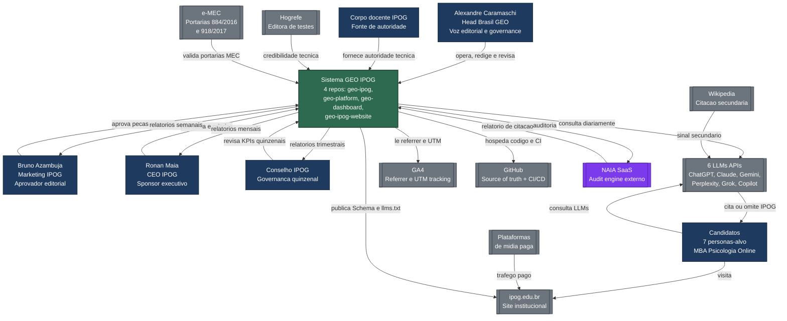
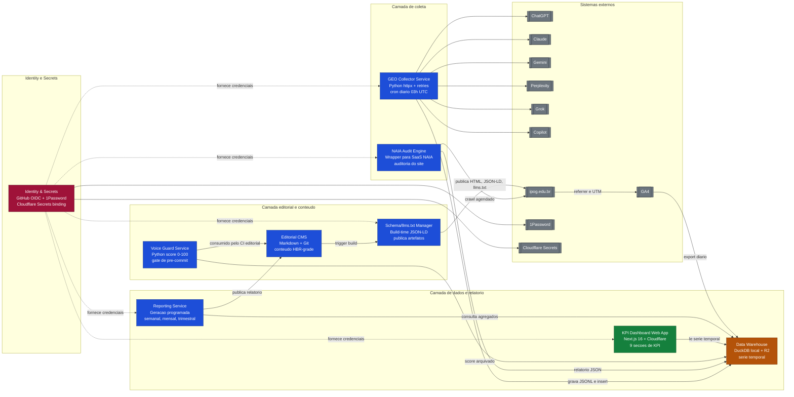
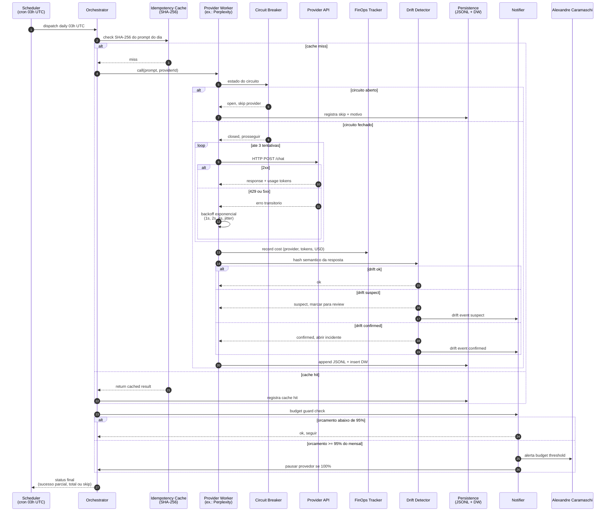
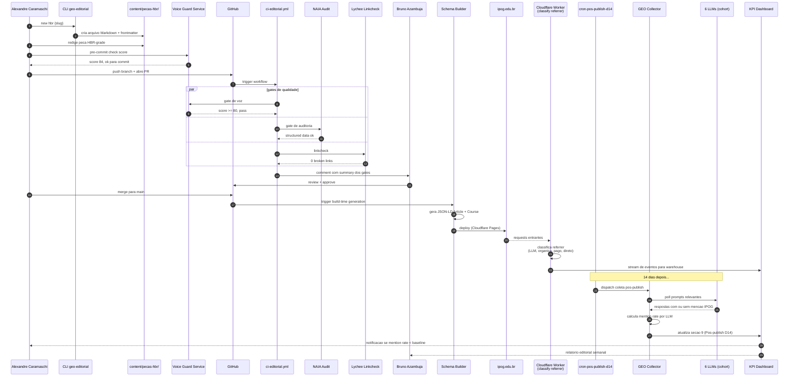
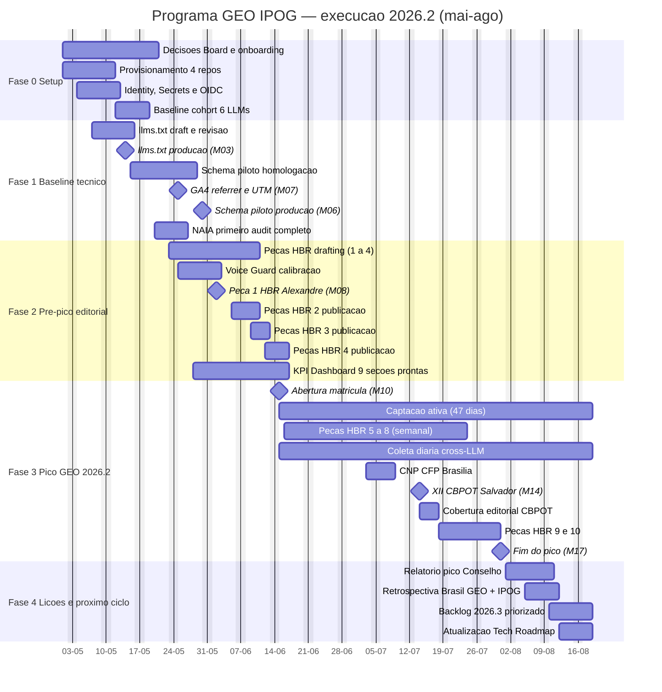

# Tech Roadmap 2026 — Bundle de Diagramas Mermaid

Documento auxiliar do `00-tech-roadmap-2026.md`. Reúne cinco diagramas Mermaid v10+ prontos para renderização em GitHub, Notion, Confluence ou plataformas que aceitem fenced blocks ` ```mermaid `. Cada diagrama traz uma legenda curta indicando audiência principal e propósito de uso. PT-BR rigoroso, sem emojis, naming canônico Brasil GEO / IPOG / Alexandre Caramaschi.

Convenções comuns:

- Atores humanos em retângulos arredondados com prefixo de papel.
- Sistemas externos (LLMs, GA4, NAIA SaaS) em hexágonos ou paralelogramos.
- Containers internos do programa GEO IPOG agrupados em subgraphs por camada (coleta, conteúdo, dados, observabilidade, identidade).
- Setas com verbo no infinitivo + objeto direto (ex.: "publica", "consulta", "audita").

---

## Diagrama 1 — C4 Level 1 (System Context)

Audiência: Conselho IPOG, sponsor Ronan Maia, marketing Bruno Azambuja. Propósito: mostrar o sistema GEO IPOG como caixa-preta e explicitar atores humanos, sistemas externos e fluxos macro de informação. Use este diagrama como abertura de qualquer apresentação executiva do programa.



Observacao: as setas entre Candidatos e LLMs sao bidirecionais para representar a jornada de descoberta cross-LLM, foco principal do programa GEO.

---

## Diagrama 2 — C4 Level 2 (Container)

Audiencia: time tecnico Brasil GEO + IPOG, arquitetos parceiros. Proposito: detalhar os 9 containers do sistema GEO IPOG, suas responsabilidades e dependencias. Cada container corresponde a um diretorio dentro de `geo-platform/`, exceto o KPI Dashboard (`geo-dashboard`), o Editorial CMS (`geo-ipog`) e o Schema/llms.txt Manager (que publica em `geo-ipog-website`).



Observacao: linhas pontilhadas representam injecao de credenciais via OIDC (GitHub Actions) e binding de secrets (Cloudflare Workers), sem persistencia local de chaves.

---

## Diagrama 3 — Sequence Diagram do fluxo critico de coleta cross-LLM

Audiencia: engenharia de plataforma, FinOps, observabilidade. Proposito: especificar o caminho feliz e os caminhos de excecao (cache hit, circuit breaker, drift detector) de uma execucao diaria do GEO Collector. Inclui retry exponencial, registro de custo e gatilho de alerta para Alexandre.



Observacao: o orchestrator executa os 6 provider workers em paralelo limitado (semaforo configuravel); o diagrama mostra um unico worker por clareza.

---

## Diagrama 4 — Sequence Diagram do publish editorial

Audiencia: time editorial (Alexandre + Bruno), engenharia de conteudo, sponsor IPOG. Proposito: rastrear o ciclo completo de uma peca HBR-grade desde o `new hbr` ate o relatorio de mention rate D+14 nas 6 LLMs, passando pelos gates de qualidade (Voice Guard, NAIA, Lychee).



Observacao: o gate paralelo (`par ... and ... and`) e renderizado pelo Mermaid como tres faixas simultaneas, evidenciando que os tres checks rodam em paralelo no CI.

---

## Diagrama 5 — Gantt mai-ago 2026 com marcos criticos

Audiencia: Conselho IPOG, sponsor Ronan, head de marketing Bruno, time Brasil GEO. Proposito: visualizar as 5 fases do programa, dependencias temporais entre entregas e marcos D-Day (M03 a M17). Use como mapa de execucao e referencia para reunioes quinzenais de governanca.



Observacao: os marcos `milestone` aparecem como losangos na linha do tempo. As barras `Captacao ativa` e `Coleta diaria cross-LLM` cobrem todo o pico (15-jun a 31-jul) e devem ser monitoradas semanalmente pelo Reporting Service. Dependencias criticas implicitas: `llms.txt producao (M03)` precede `Schema piloto producao (M06)`; `GA4 referrer e UTM (M07)` precede `Abertura matricula (M10)`; `Peca 1 HBR (M08)` antecede o lancamento da matricula em 13 dias para garantir indexacao nas LLMs.

---

## Como renderizar este bundle

1. GitHub e GitLab renderizam os blocos ` ```mermaid ` nativamente em arquivos `.md`.
2. Em Notion, cole cada bloco em um Code block com linguagem `mermaid`.
3. Em Confluence, use a macro `Mermaid Diagrams for Confluence` ou exporte SVG via `mermaid-cli` (`mmdc -i 00c-roadmap-diagramas-mermaid.md -o roadmap.pdf`).
4. Para preservar tipografia e cores em apresentacoes Conselho, exporte SVG com tema `default` e fundo branco.

Versionamento: este arquivo e auxiliar (`_aux/`) do `00-tech-roadmap-2026.md` e deve ser atualizado em conjunto com qualquer mudanca em `01-solution-architecture.md` Bloco B (containers) ou em marcos do roadmap.
